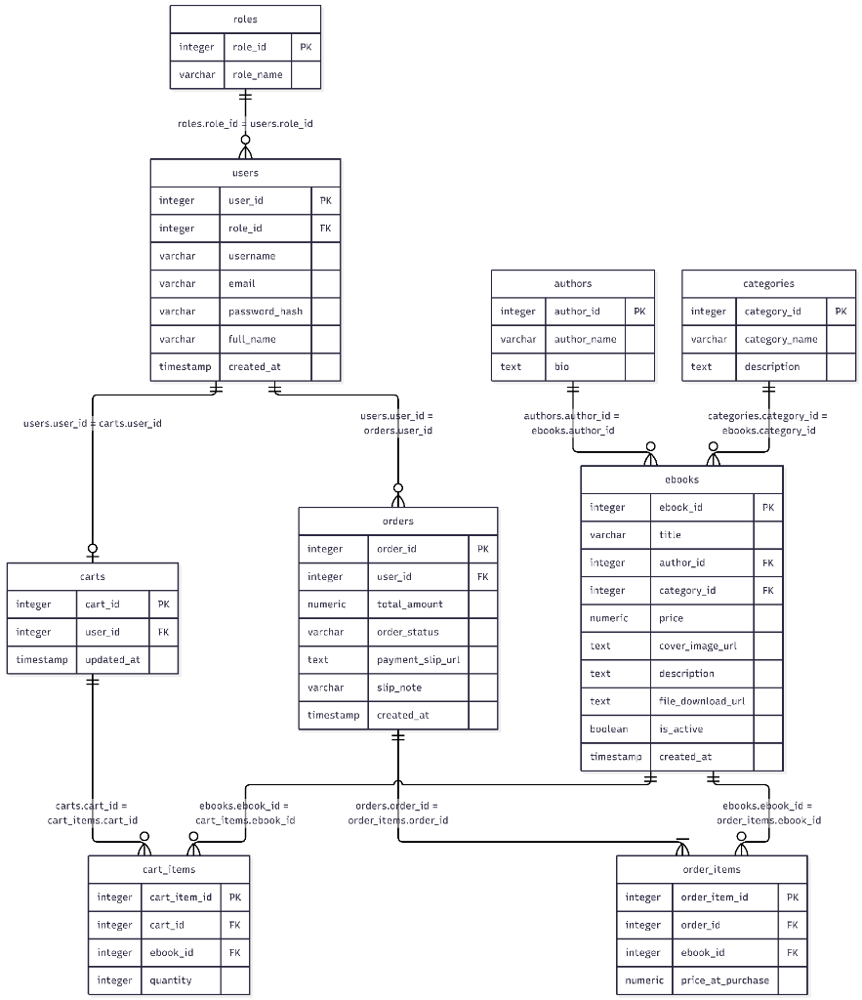
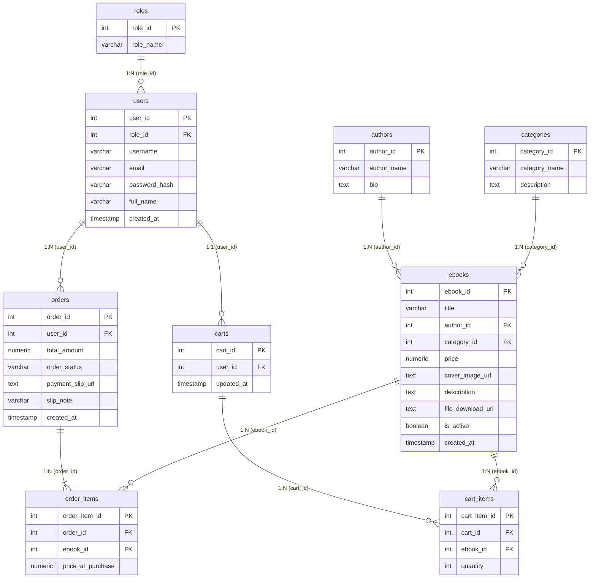

# เล่มรายงานโครงงานพัฒนาระบบฐานข้อมูล (Database Mini Project Report)

---

<div align="center">

# การวิเคราะห์และพัฒนาระบบร้านขายหนังสือและอีบุ๊กออนไลน์
## (E-Book Store Online Management System)

**โครงงานพัฒนาระบบฐานข้อมูล (Database Mini Project)**  
**รายวิชาระบบฐานข้อมูล (Database Systems)**

<br/>

### ข้อมูลกลุ่มและผู้จัดทำโครงงาน (Group Information)
| ลำดับ | ชื่อ-นามสกุล | รหัสนักศึกษา | บทบาทหน้าที่ความรับผิดชอบ |
| :---: | :--- | :---: | :--- |
| **คนที่ 1** | **นายสุรวัจน์ ชลเรืองทรัพย์** | **67332110217-1** | ออกแบบฐานข้อมูล (ERD, 3NF), พัฒนาระบบหน้าร้าน ตะกร้าสินค้า และคำสั่งซื้อ, Transactional Checkout, เขียน SQL รายงานที่ 1 และ 2 |
| **คนที่ 2** | **นายสรวิชญ์ มีมาก** | **67332110275-8** | ออกแบบความปลอดภัย (RBAC & Route Guard), ระบบหลังบ้าน (Admin), กลไกล็อกดาวน์โหลด (Access Control), เขียน SQL รายงานที่ 3 และ 4, แผนทดสอบระบบ (QA) |

<br/>

**โครงงานนี้เป็นส่วนหนึ่งของการศึกษารายวิชา**  
ระบบฐานข้อมูล (Database Systems)  
สาขาวิชาวิศวกรรมคอมพิวเตอร์ คณะวิศวกรรมศาสตร์  
มหาวิทยาลัยเทคโนโลยีราชมงคลอีสาน วิทยาเขตขอนแก่น  

</div>

---

## สารบัญ (Table of Contents)

| ลำดับบท / หัวข้อ | หน้า |
| :--- | :---: |
| **บทสรุปผู้บริหาร (Executive Summary)** | **1** |
| **บทที่ 1: บทนำและวัตถุประสงค์ของโครงงาน** | **2** |
| &emsp;1.1 ที่มาและความสำคัญของปัญหา | 2 |
| &emsp;1.2 วัตถุประสงค์ของโครงงาน (สอดคล้องตามใบงาน) | 2 |
| &emsp;1.3 ขอบเขตของระบบ (System Scope) | 3 |
| &emsp;&emsp;1.3.1 ขอบเขตส่วนหน้าร้าน (Customer Portal) | 3 |
| &emsp;&emsp;1.3.2 ขอบเขตส่วนหลังบ้าน (Admin Backoffice) | 3 |
| &emsp;&emsp;1.3.3 เงื่อนไขความปลอดภัยในการส่งมอบสินค้าดิจิทัล | 4 |
| &emsp;1.4 สถาปัตยกรรมและเทคโนโลยีที่ใช้พัฒนา (Technology Stack) | 4 |
| **บทที่ 2: การวิเคราะห์และออกแบบฐานข้อมูล (Database Analysis & Design)** | **5** |
| &emsp;2.1 โครงสร้างผังความสัมพันธ์ข้อมูล (Entity-Relationship Diagram: ERD) | 5 |
| &emsp;2.2 ทฤษฎีการจัดรูปแบบบรรทัดฐาน (Database Normalization to 3NF) | 7 |
| &emsp;2.3 พจนานุกรมข้อมูลฉบับสมบูรณ์ 9 ตาราง (Data Dictionary) | 9 |
| **บทที่ 3: การสร้างฐานข้อมูลและข้อกำหนดบูรณภาพข้อมูล (Implementation & Constraints)** | **14** |
| &emsp;3.1 DDL Scripts และการสร้างตารางบน PostgreSQL (Neon Cloud) | 14 |
| &emsp;3.2 ข้อกำหนดบูรณภาพข้อมูล (Integrity Constraints & Referential Actions) | 16 |
| &emsp;3.3 ข้อมูลตัวอย่างทดสอบระบบจริงในฐานข้อมูล (Seed Data) | 17 |
| **บทที่ 4: รายงานวิเคราะห์ข้อมูลเชิงลึกจากฐานข้อมูลจริง 4 ด้าน (Analytics Reports)** | **18** |
| &emsp;4.1 รายงานที่ 1: ยอดขายตามช่วงเวลา (Sales Over Time by Date) | 18 |
| &emsp;4.2 รายงานที่ 2: E-Book ขายดีที่สุด 5 อันดับแรก (Top-Selling Books) | 20 |
| &emsp;4.3 รายงานที่ 3: ยอดขายตามหมวดหมู่หนังสือ (Sales by Category) | 22 |
| &emsp;4.4 รายงานที่ 4: พฤติกรรมลูกค้าและยอดซื้อสะสม (Customer Lifetime Spending) | 24 |
| **บทที่ 5: การพัฒนาเว็บแอปพลิเคชันและการควบคุมสิทธิ์การเข้าถึง (Application Flow & Security)** | **26** |
| &emsp;5.1 การยืนยันตัวตนและวงจรตะกร้าสินค้า (Authentication & Shopping Cart Lifecycle) | 26 |
| &emsp;5.2 กระบวนการสั่งซื้อ ชำระเงินจำลอง และ Database Transaction (BEGIN / COMMIT) | 27 |
| &emsp;5.3 ระบบความปลอดภัยการดาวน์โหลดไฟล์ (Digital Asset Access Control) | 28 |
| &emsp;5.4 ระบบควบคุมสิทธิ์ผู้ดูแลระบบ (Role-Based Access Control: RBAC & Route Guard) | 29 |
| &emsp;5.5 ระบบบริหารจัดการหลังบ้านและการส่งออกรายงาน CSV มาตรฐานภาษาไทย (UTF-8 BOM) | 30 |
| **บทที่ 6: แผนการทดสอบและประกันคุณภาพข้อมูล (Testing & Quality Assurance)** | **31** |
| &emsp;ตารางบันทึกผลการทดสอบระบบ 8 กรณีตามเกณฑ์ใบงานข้อ 6 (TC-01 - TC-08) | 31 |
| **บทที่ 7: การประยุกต์ใช้ปัญญาประดิษฐ์อย่างรับผิดชอบ (Responsible AI Usage Log)** | **33** |
| &emsp;7.1 บันทึกการใช้งาน AI ในการพัฒนา (AI Prompt & Usage Log) | 33 |
| &emsp;7.2 ข้อเสนอแนะของ AI ที่ผู้พัฒนาตัดสินใจปฏิเสธ (Rejected AI Proposals) | 34 |
| &emsp;7.3 การปฏิบัติตามกฎหมายคุ้มครองข้อมูลส่วนบุคคล (PDPA Consideration) | 35 |
| **บทที่ 8: สรุปผลการดำเนินงานและข้อเสนอแนะ (Conclusion & Future Work)** | **36** |
| &emsp;8.1 สรุปผลสัมฤทธิ์ของโครงงานเทียบตามเกณฑ์ประเมิน 100 คะแนน | 36 |
| &emsp;8.2 ข้อเสนอแนะในการพัฒนาต่อยอดระบบ | 37 |
| **ภาคผนวก (Appendices)** | **38** |
| &emsp;ภาคผนวก ก: รายการตรวจสอบความพร้อมก่อนส่งงาน (Submission Checklist) และใบลงนามรับรอง | 38 |
| &emsp;ภาคผนวก ข: ข้อมูลการเชื่อมต่อและวิธีเปิดใช้งานระบบเพื่อการตรวจประเมิน | 39 |

---

# บทสรุปผู้บริหาร (Executive Summary)

โครงงานพัฒนาระบบฐานข้อมูล **"ร้านขายหนังสือและอีบุ๊กออนไลน์ (E-Book Store)"** ในโฟลเดอร์โปรเจกต์ `ebook-store` ได้รับการออกแบบและพัฒนาขึ้นเพื่อประยุกต์ใช้ทฤษฎีระบบจัดการฐานข้อมูลเชิงสัมพันธ์ (Relational Database Management Systems: RDBMS) ให้ตอบโจทย์กระบวนการซื้อขายและส่งมอบสินค้าดิจิทัลในสถานการณ์จริง ตรงตามเกณฑ์การประเมิน 100 คะแนนเต็มของรายวิชาระบบฐานข้อมูล

ระบบทำงานร่วมกับฐานข้อมูล **PostgreSQL บน Neon Cloud Platform** ผ่านโครงสร้างฐานข้อมูลเชิงสัมพันธ์จำนวนทั้งสิ้น **9 ตาราง** ได้แก่:
1. `roles` (ตารางบทบาทผู้ใช้งาน: customer, admin)
2. `users` (ตารางสมาชิกและผู้ดูแลระบบ)
3. `authors` (ตารางข้อมูลผู้แต่ง / นักเขียน)
4. `categories` (ตารางหมวดหมู่หนังสือ)
5. `ebooks` (ตารางข้อมูลหนังสือดิจิทัล E-Book)
6. `carts` (ตารางหัวตะกร้าสินค้าแยกตามผู้ใช้)
7. `cart_items` (ตารางรายการสินค้าที่เลือกไว้ในตะกร้า)
8. `orders` (ตารางคำสั่งซื้อหลักและหลักฐานสลิปจำลอง)
9. `order_items` (ตารางรายการสินค้าที่ซื้อจริงในแต่ละคำสั่งซื้อ)

### จุดเด่นเชิงวิศวกรรมของระบบ:
- **ความถูกต้องตามทฤษฎี 3NF**: ขจัดปัญหาความซ้ำซ้อนของข้อมูล และแยกตาราง `order_items` พร้อมฟิลด์ `price_at_purchase` เพื่อบันทึกราคาซื้อขายประวัติศาสตร์อย่างถาวร ป้องกันปัญหาการแก้ไขราคาหนังสือในปัจจุบันแล้วกระทบยอดรวมในอดีต
- **ความปลอดภัยของสินค้าดิจิทัล (Digital Content Protection)**: สอดคล้องตามข้อกำหนดใบงานข้อ 2.2 ระบบจะล็อกไฟล์หนังสือไว้สำหรับคำสั่งซื้อที่อยู่ในสถานะรอตรวจสอบ (`pending`) และจะปลดล็อกให้เปิดอ่าน/ดาวน์โหลดไฟล์ลิขสิทธิ์ได้เฉพาะเมื่อผู้ดูแลระบบตรวจสอบหลักฐานและปรับสถานะเป็นยืนยันแล้ว (`confirmed`) เท่านั้น หากพยายามเข้าถึงไฟล์ผ่าน URL โดยตรง ระบบจะตรวจสอบสิทธิ์ในระดับ SQL และส่งกลับรหัสสถานะ `403 Forbidden`
- **ระบบควบคุมสิทธิ์ระดับเซิร์ฟเวอร์ (RBAC & Route Guard)**: ผู้ใช้ทั่วไปจะถูกซ่อนเมนูจัดการร้าน และมี Middleware ดักจับการพิมพ์ URL เส้นทาง `/admin/*` โดยส่งข้อความปฏิเสธสิทธิ์ทันที
- **การประมวลผลข้อมูลจริงมากกว่า 30 คำสั่งซื้อ**: ระบบมีข้อมูลธุรกรรมในฐานข้อมูลจริงรวม **35 คำสั่งซื้อ (Orders)** แบ่งเป็นสถานะ `confirmed` 29 รายการ, `pending` 3 รายการ, และ `cancelled` 3 รายการ รวมเป็นยอดขายสุทธิ ฿16,500.00
- **รายงานวิเคราะห์ธุรกิจ 4 ด้าน**: พัฒนา Aggregate Query ด้วยคำสั่ง SQL สดผ่านหน้าจอ `/reports` ครอบคลุมยอดขายตามช่วงเวลา, 5 อันดับหนังสือขายดี, สรุปยอดขายตามหมวดหมู่, และยอดซื้อสะสมของลูกค้า พร้อมปุ่ม Export CSV ที่ฝังรหัส **UTF-8 BOM (`\uFEFF`)** ทำให้เปิดอ่านภาษาไทยใน Microsoft Excel ได้อย่างถูกต้อง ไม่เกิดปัญหาภาษาต่างดาว (Mojibake)

---

# บทที่ 1: บทนำและวัตถุประสงค์ของโครงงาน

## 1.1 ที่มาและความสำคัญของปัญหา
ในยุคปัจจุบัน พฤติกรรมการอ่านของผู้บริโภคได้เปลี่ยนผ่านเข้าสู่รูปแบบดิจิทัลอย่างรวดเร็ว หนังสืออิเล็กทรอนิกส์ (E-Book) จึงเป็นสินค้าที่ได้รับความนิยมสูง อย่างไรก็ตาม การพัฒนาระบบพาณิชย์อิเล็กทรอนิกส์สำหรับสินค้าประเภท E-Book มีความท้าทายที่แตกต่างจากการจำหน่ายสินค้าทั่วไปอย่างมีนัยสำคัญ:
1. **ด้านคลังสินค้าและราคาประวัติศาสตร์**: สินค้าดิจิทัลไม่มีสต็อกทางกายภาพที่หมดไป แต่การบันทึกรายการคำสั่งซื้อจำเป็นต้องตรึงราคา ณ เวลาที่สั่งซื้อ (`price_at_purchase`) เพื่อความถูกต้องทางบัญชี
2. **ด้านความปลอดภัยในการเข้าถึงเนื้อหา (Access Authorization)**: ต้องมีกลไกป้องกันไม่ให้ผู้ใช้เข้าถึงไฟล์ E-Book ก่อนการยืนยันการชำระเงิน และต้องป้องกันไม่ให้ผู้ใช้คนอื่นแอบอ้างลิงก์ดาวน์โหลดของผู้อื่น
3. **ด้านการควบคุมสิทธิ์ผู้ใช้งาน (Access Control)**: ต้องแยกระหว่างลูกค้าทั่วไปและผู้ดูแลร้านค้าอย่างเด็ดขาด ทั้งในระดับหน้ากากส่วนติดต่อผู้ใช้ (UI) และระดับตัวควบคุมคำสั่ง (Route Controller)
4. **ด้านการวิเคราะห์ข้อมูลเชิงธุรกิจ (Business Intelligence)**: ข้อมูลธุรกรรมที่เกิดขึ้นต้องถูกจัดเก็บอย่างเป็นระเบียบตามมาตรฐาน เพื่อให้สามารถประมวลผล Aggregate Metrics เช่น ยอดขายรายวัน สินค้าขายดี และพฤติกรรมลูกค้าได้อย่างรวดเร็ว

ด้วยเหตุนี้ โครงงาน `ebook-store` จึงมุ่งเน้นการวิเคราะห์และออกแบบฐานข้อมูลเชิงสัมพันธ์ให้มีความสมบูรณ์ตามหลัก Normalization ระดับ 3NF พร้อมทั้งพัฒนาเว็บแอปพลิเคชันต้นแบบที่เชื่อมโยงกับฐานข้อมูลจริง เพื่อพิสูจน์การทำงานของระบบอย่างรอบด้าน

## 1.2 วัตถุประสงค์ของโครงงาน (สอดคล้องตามเกณฑ์ใบงาน)
1. เพื่อออกแบบโครงสร้างฐานข้อมูลเชิงสัมพันธ์ที่สัมพันธ์กับกระบวนการขาย E-Book อย่างถูกต้อง ครบถ้วนตามมาตรฐาน 3NF ไม่น้อยกว่า 8 ตาราง
2. เพื่อพัฒนาระบบเว็บแอปพลิเคชันต้นแบบ (Prototype) ด้วย Node.js / Express.js เชื่อมโยงกับฐานข้อมูล PostgreSQL บน Cloud ได้จริง
3. เพื่อจำลองเส้นทางการใช้งานของลูกค้า (Customer Journey) ตั้งแต่สมัครสมาชิก เลือกสินค้า ใส่ตะกร้า ชำระเงินจำลอง และการเข้าถึงไฟล์อ่านหนังสือ
4. เพื่อพัฒนาระบบบริหารจัดการร้านค้าหลังบ้าน (Admin Backoffice) สำหรับผู้ดูแลระบบ พร้อมระบบ Route Guard ป้องกันการละเมิดสิทธิ์
5. เพื่อเขียนคำสั่ง SQL วิเคราะห์ข้อมูลจริงในระบบ 4 ด้าน และพัฒนาระบบส่งออกข้อมูลสรุปยอดขายเป็นไฟล์ CSV รองรับภาษาไทย
6. เพื่อฝึกฝนการประยุกต์ใช้ปัญญาประดิษฐ์ (AI) ในการออกแบบและเขียนโค้ดอย่างมีความรับผิดชอบ โปร่งใส และเปิดเผยตามจรรยาบรรณวิชาชีพ

## 1.3 ขอบเขตของระบบ (System Scope)

### 1.3.1 ขอบเขตส่วนหน้าร้านสำหรับลูกค้า (Customer Portal)
- **ระบบสมาชิก**: สมัครสมาชิกใหม่ (`/register`), เข้าสู่ระบบ (`/login`), ออกจากระบบ (`/logout`), และหน้าแก้ไขข้อมูลส่วนตัว (`/profile`)
- **ระบบแคตตาล็อกหนังสือ**: แสดงรายการ E-Book ที่เปิดขาย (`is_active = TRUE`) พร้อมข้อมูลภาพปก ชื่อเรื่อง ผู้แต่ง หมวดหมู่ และราคา
- **ระบบค้นหาและคัดกรอง**: ค้นหาหนังสือด้วยชื่อเรื่องหรือชื่อผู้แต่งด้วยคำสั่ง SQL `ILIKE` และระบบกรองหนังสือตามหมวดหมู่อย่างน้อย 4 หมวดหมู่
- **ระบบตะกร้าสินค้า (Cart Lifecycle)**: เพิ่มหนังสือลงตะกร้า ปรับเพิ่ม-ลดจำนวน (`quantity`) ลบรายการ และคำนวณยอดเงินรวมแบบ Real-time
- **ระบบสั่งซื้อและชำระเงินจำลอง (Mock Checkout)**: ยืนยันคำสั่งซื้อจากตะกร้า บันทึกลงตารางคำสั่งซื้อหลักและรายการย่อย พร้อมแนบสลิปโอนเงิน PromptPay จำลอง โดยไม่มีการขอข้อมูลบัตรเครดิตหรือบัญชีจริงของผู้ใช้
- **ประวัติคำสั่งซื้อและการอ่านหนังสือ (`/my-orders`)**: ลูกค้าสามารถดูประวัติคำสั่งซื้อและสถานะของตนเองได้

### 1.3.2 ขอบเขตส่วนหลังบ้านสำหรับผู้ดูแลระบบ (Admin Backoffice)
- **ระบบป้องกันสิทธิ์ (RBAC)**: ซ่อนเมนูจัดการร้านค้าจากลูกค้าทั่วไป และใช้ Middleware ตรวจสอบ Role ของผู้ใช้ หากไม่ใช่ Admin จะบล็อกการเข้าถึงด้วยหน้า `403 Forbidden`
- **จัดการคำสั่งซื้อ (`/admin/orders`)**: ตรวจสอบรายการคำสั่งซื้อ ยอดเงิน และภาพสลิป พร้อมปุ่มกด "ยืนยัน (Confirmed)" หรือ "ยกเลิก (Cancelled)"
- **จัดการหนังสือ E-Book (`/admin/ebooks`)**: เพิ่มหนังสือใหม่ แก้ไขราคา รายละเอียด และปุ่มสลับสถานะ "พร้อมขาย" / "ปิดขาย" (Soft Delete: `is_active`)
- **จัดการผู้แต่ง (`/admin/add-author`)**: เพิ่มรายชื่อนักเขียนใหม่เข้าสู่ฐานข้อมูล
- **จัดการหมวดหมู่ (`/admin/categories`)**: เพิ่มหมวดหมู่ใหม่ และระบบลบหมวดหมู่ที่มีการตรวจจับเงื่อนไขความสัมพันธ์ของหนังสือ
- **จัดการผู้ใช้งาน (`/admin/users`)**: ตรวจสอบบัญชีผู้ใช้ในระบบ และปุ่มสลับสิทธิ์ระหว่าง Admin และ Customer

### 1.3.3 เงื่อนไขความปลอดภัยในการส่งมอบสินค้าดิจิทัล (Digital Content Security)
สอดคล้องตามข้อกำหนดใบงานข้อ 2.2:
- ระบบจะไม่เปิดลิงก์ดาวน์โหลดหรืออนุญาตให้เปิดอ่านเนื้อหา E-Book ในคำสั่งซื้อที่ยังไม่ได้รับการยืนยัน (`order_status = 'pending'`)
- หากผู้ใช้พยายามเข้าถึงผ่าน URL `/download/:ebookId` โดยตรง ตัวควบคุมจะตรวจสอบคำสั่งซื้อในฐานข้อมูลว่าผู้ใช้นั้นมีคำสั่งซื้อที่ `confirmed` จริงหรือไม่ หากไม่มี จะปฏิเสธคำขอด้วยรหัส `403 Forbidden` ทันที

## 1.4 สถาปัตยกรรมและเทคโนโลยีที่ใช้พัฒนา (Technology Stack)

```
[Client Browser] 
      │ (HTTP / HTML Forms / JSON)
      ▼
[Express.js Server] ── (Session Guard & Controllers)
      │
      ├── routes/auth.js      (Login / Register / Profile)
      ├── routes/shop.js      (Catalog / Cart / Orders / Download)
      ├── routes/admin.js     (Backoffice CRUD & RBAC Guard)
      └── routes/reports.js   (4 Complex SQL Analytics & CSV Export)
      │
      ▼ (node-postgres Connection Pool)
[Neon Cloud PostgreSQL Database] ── (9 Relational Tables with 3NF Schema)
```

| ส่วนประกอบ | เทคโนโลยีที่เลือกใช้ | บทบาทและความสำคัญในโครงงาน |
| :--- | :--- | :--- |
| **ระบบจัดการฐานข้อมูล (DBMS)** | **PostgreSQL (Neon Cloud)** | ฐานข้อมูลเชิงสัมพันธ์บนคลาวด์ รองรับ ACID Transaction, Constraints, Sequences, Indexes และ Aggregate Functions |
| **สภาพแวดล้อมฝั่งเซิร์ฟเวอร์ (Runtime)** | **Node.js (v24.x) & Express.js (v5.2.1)** | ประมวลผลแบ็กเอนด์แบบ Event-driven รองรับการเชื่อมต่อฐานข้อมูลแบบ Non-blocking I/O |
| **ระบบเซสชัน (Authentication)** | **express-session (v1.19.0)** | จัดการสถานะการเข้าสู่ระบบของผู้ใช้ฝั่งเซิร์ฟเวอร์อย่างปลอดภัย พร้อมเก็บสิทธิ์ `role_name` |
| **ไดรเวอร์เชื่อมต่อฐานข้อมูล** | **pg (node-postgres v8.23.0)** | จัดการ Connection Pooling เชื่อมต่อไปยัง Neon Serverless PostgreSQL อย่างเสถียร |
| **การจัดรูปแบบหน้าจอ (Styling)** | **Tailwind CSS (CDN)** | ตกแต่งหน้าจอให้สวยงาม สไตล์ Minimalist สะอาดตา และรองรับการแสดงผลแบบ Responsive |
| **การส่งออกรายงาน (Export Format)** | **CSV with UTF-8 BOM (`\uFEFF`)** | เข้ารหัสชุดข้อมูลตัวอักษรภาษาไทย ป้องกันปัญหาตัวอักษรเพี้ยนในโปรแกรม Microsoft Excel |

---

# บทที่ 2: การวิเคราะห์และออกแบบฐานข้อมูล

## 2.1 โครงสร้างผังความสัมพันธ์ข้อมูล (Entity-Relationship Diagram: ERD)

ฐานข้อมูลของโปรเจกต์ `ebook-store` ประกอบด้วยตารางเชิงสัมพันธ์จำนวน **9 ตาราง** สอดคล้องตามข้อกำหนดของใบงาน (กำหนดขั้นต่ำ 8 ตาราง) โดยแสดงความสัมพันธ์ตามมาตรฐาน Crow's Foot Notation ครบถ้วน:

<div align="center">



*รูปที่ 2.1: ผังความสัมพันธ์ข้อมูลเชิงสัมพันธ์สัญลักษณ์ Crow's Foot (ERD) ระบบ E-Book Store (3NF Schema 9 ตาราง)*

</div>



### สรุปคำอธิบายความสัมพันธ์และภาระงาน (Cardinality Rules):
1. **`roles` (1) <---> (N) `users`**: บทบาทหนึ่งบทบาท (customer, admin) สามารถกำหนดให้ผู้ใช้งานได้หลายคน เชื่อมด้วย `roles.role_id = users.role_id`
2. **`users` (1) <---> (0..1) `carts`**: ผู้ใช้แต่ละคนมีตะกร้าสินค้าประจำตัวได้สูงสุด 1 ใบ หรือยังไม่มีก็ได้ เชื่อมด้วย `users.user_id = carts.user_id`
3. **`carts` (1) <---> (N) `cart_items`**: ตะกร้าสินค้า 1 ใบ สามารถบรรจุรายการหนังสือที่เตรียมสั่งซื้อได้หลายเล่ม เชื่อมด้วย `carts.cart_id = cart_items.cart_id`
4. **`ebooks` (1) <---> (N) `cart_items`**: หนังสือ 1 เล่ม สามารถปรากฏอยู่ในตะกร้าสินค้าของผู้ใช้หลายคนพร้อมกันได้ เชื่อมด้วย `ebooks.ebook_id = cart_items.ebook_id`
5. **`authors` (1) <---> (N) `ebooks`**: นักเขียน 1 ท่าน สามารถมีผลงานหนังสือในระบบได้หลายเล่ม เชื่อมด้วย `authors.author_id = ebooks.author_id`
6. **`categories` (1) <---> (N) `ebooks`**: หมวดหมู่หนังสือ 1 หมวด สามารถจัดเก็บหนังสือได้หลายเล่ม เชื่อมด้วย `categories.category_id = ebooks.category_id`
7. **`users` (1) <---> (N) `orders`**: สมาชิก 1 คน สามารถสร้างคำสั่งซื้อได้หลายครั้งในระบบ เชื่อมด้วย `users.user_id = orders.user_id`
8. **`orders` (1) <---> (1..N) `order_items`**: คำสั่งซื้อ 1 คำสั่งซื้อ ประกอบด้วยรายการหนังสือย่อยที่สั่งซื้ออย่างน้อย 1 รายการขึ้นไป เชื่อมด้วย `orders.order_id = order_items.order_id`
9. **`ebooks` (1) <---> (N) `order_items`**: หนังสือแต่ละเล่มสามารถถูกสั่งซื้อซ้ำในรายการย่อยของคำสั่งซื้อต่าง ๆ ได้หลายครั้ง เชื่อมด้วย `ebooks.ebook_id = order_items.ebook_id`

---

## 2.2 ทฤษฎีการจัดรูปแบบบรรทัดฐาน (Database Normalization to 3NF)

การจัดโครงสร้างฐานข้อมูลของ `ebook-store` ผ่านการวิเคราะห์ตามหลักการปรับรูปบรรทัดฐาน 4 ขั้นตอน:

### 1. รูปแบบก่อนบรรทัดฐาน (Unnormalized Form: UNF)
หากรวมข้อมูลการสั่งซื้อและข้อมูลสินค้าไว้ในตารางเดียว:  
`Order_Flat(order_id, user_id, username, full_name, role_name, book_titles, authors, categories, prices, quantities, total_amount, order_status, slip_url)`  
**ข้อบกพร่อง:** เกิดกลุ่มข้อมูลซ้ำ (Repeating Groups) ในส่วนของรายการหนังสือ ผู้แต่ง และหมวดหมู่ ทำให้เกิดความซ้ำซ้อนอย่างรุนแรงและไม่สามารถจัดการข้อมูลได้อย่างมีประสิทธิภาพ

### 2. รูปแบบบรรทัดฐานขั้นที่ 1 (First Normal Form: 1NF)
- **หลักเกณฑ์:** ทุกคอลัมน์ต้องเก็บค่าที่เป็นค่าเดี่ยว (Atomic Values) และไม่มี Repeating Groups โดยมี Primary Key กำหนดเอกลักษณ์ของแถว
- **การดำเนินการ:** แตกข้อมูลรายการสินค้าในคำสั่งซื้อออกมาเป็นแต่ละแถวเดี่ยว ทำให้ไม่มีชุดข้อมูลอาร์เรย์อยู่ในคอลัมน์เดียว

### 3. รูปแบบบรรทัดฐานขั้นที่ 2 (Second Normal Form: 2NF)
- **หลักเกณฑ์:** อยู่ใน 1NF แล้ว และทุก Non-Key Attribute ต้องขึ้นตรงต่อ Candidate Key ทั้งหมดแบบสมบูรณ์ (Full Functional Dependency) ต้องไม่มี Partial Dependency
- **การดำเนินการ:**
  - แยกข้อมูลหนังสือออกจากรายการสั่งซื้อ โดยสร้างตาราง `ebooks` แยกออกมา
  - สร้างตาราง `order_items` เพื่อเชื่อมความสัมพันธ์แบบ N:M ระหว่าง `orders` และ `ebooks`
  - **การออกแบบที่สำคัญ:** ในตาราง `order_items` มีการเพิ่มฟิลด์ `price_at_purchase` เพื่อบันทึกราคาหนังสือ ณ วันและเวลาที่สั่งซื้อจริง เพื่อรักษาสัจธรรมทางบัญชี แม้ในอนาคตผู้ดูแลร้านจะปรับราคาในตาราง `ebooks` ยอดเงินรวมในคำสั่งซื้ออดีตจะไม่ผิดเพี้ยน

### 4. รูปแบบบรรทัดฐานขั้นที่ 3 (Third Normal Form: 3NF)
- **หลักเกณฑ์:** อยู่ใน 2NF แล้ว และต้องไม่มี Transitive Dependency (ไม่มีฟิลด์ Non-Key ใดที่ขึ้นตรงต่อฟิลด์ Non-Key อื่นทางอ้อม)
- **การดำเนินการ:**
  - ในส่วนของผู้ใช้: ทำการแยกบทบาทออกมาเป็นตาราง `roles` (`user_id -> role_id -> role_name`)
  - ในส่วนของสินค้า: ทำการแยกผู้แต่งออกมาเป็นตาราง `authors` (`ebook_id -> author_id -> author_name`) และแยกหมวดหมู่ออกมาเป็น `categories` (`ebook_id -> category_id -> category_name`)
  - ในส่วนของตะกร้า: แยกตาราง `carts` และ `cart_items` ออกจากตารางผู้ใช้และคำสั่งซื้อ เพื่อจัดการสถานะชั่วคราวก่อนเกิดการสั่งซื้อจริง

**สรุปผลการจัดรูปบรรทัดฐาน:** ฐานข้อมูลทั้ง 9 ตารางของ `ebook-store` มีความสมบูรณ์ตามหลัก 3NF ช่วยป้องกันปัญหา Update Anomaly, Insertion Anomaly และ Deletion Anomaly ได้อย่างมีประสิทธิภาพ

---

## 2.3 พจนานุกรมข้อมูลฉบับสมบูรณ์ 9 ตาราง (Data Dictionary)

รายละเอียดข้อกำหนดฟิลด์ข้อมูล ชนิดข้อมูล และข้อจำกัดที่ใช้งานจริงในฐานข้อมูล:

### ตารางที่ 1: `roles` (บทบาทผู้ใช้งานในระบบ)
| ลำดับ | ชื่อฟิลด์ (Column) | ชนิดข้อมูล (Data Type) | ข้อกำหนด (Constraints) | คำอธิบายความหมาย |
| :---: | :--- | :--- | :--- | :--- |
| 1 | `role_id` | INTEGER | PRIMARY KEY, AUTO_INCREMENT | รหัสบทบาทผู้ใช้งาน (1 = customer, 2 = admin) |
| 2 | `role_name` | VARCHAR(50) | NOT NULL | ชื่อบทบาท เช่น 'customer', 'admin' |

### ตารางที่ 2: `users` (ข้อมูลสมาชิกและผู้ดูแลระบบ)
| ลำดับ | ชื่อฟิลด์ (Column) | ชนิดข้อมูล (Data Type) | ข้อกำหนด (Constraints) | คำอธิบายความหมาย |
| :---: | :--- | :--- | :--- | :--- |
| 1 | `user_id` | INTEGER | PRIMARY KEY, AUTO_INCREMENT | รหัสประจำตัวผู้ใช้งาน |
| 2 | `role_id` | INTEGER | NOT NULL, DEFAULT 1, FK -> `roles(role_id)` | รหัสบทบาท อ้างอิงตาราง roles |
| 3 | `username` | VARCHAR(50) | NOT NULL, UNIQUE | ชื่อผู้ใช้สำหรับล็อกอินเข้าสู่ระบบ |
| 4 | `email` | VARCHAR(100) | NOT NULL, UNIQUE | อีเมลประจำตัวผู้ใช้งาน |
| 5 | `password_hash`| VARCHAR(255) | NOT NULL | รหัสผ่านสำหรับการตรวจสอบตัวตน |
| 6 | `full_name` | VARCHAR(100) | NOT NULL | ชื่อ-นามสกุลจริงของผู้ใช้งาน |
| 7 | `created_at` | TIMESTAMP | DEFAULT CURRENT_TIMESTAMP | วันและเวลาที่ลงทะเบียนสมาชิก |

### ตารางที่ 3: `authors` (ข้อมูลผู้แต่ง / นักเขียน)
| ลำดับ | ชื่อฟิลด์ (Column) | ชนิดข้อมูล (Data Type) | ข้อกำหนด (Constraints) | คำอธิบายความหมาย |
| :---: | :--- | :--- | :--- | :--- |
| 1 | `author_id` | INTEGER | PRIMARY KEY, AUTO_INCREMENT | รหัสประจำตัวนักเขียน |
| 2 | `author_name` | VARCHAR(100) | NOT NULL | ชื่อ-นามสกุล หรือนามปากกาผู้แต่ง |
| 3 | `bio` | TEXT | NULLABLE | ประวัติและผลงานโดยย่อ |

### ตารางที่ 4: `categories` (หมวดหมู่หนังสือ)
| ลำดับ | ชื่อฟิลด์ (Column) | ชนิดข้อมูล (Data Type) | ข้อกำหนด (Constraints) | คำอธิบายความหมาย |
| :---: | :--- | :--- | :--- | :--- |
| 1 | `category_id` | INTEGER | PRIMARY KEY, AUTO_INCREMENT | รหัสประจำตัวหมวดหมู่ |
| 2 | `category_name` | VARCHAR(100) | NOT NULL | ชื่อหมวดหมู่หนังสือ เช่น Computer & Programming |
| 3 | `description` | TEXT | NULLABLE | คำอธิบายขอบเขตของหมวดหมู่ |

### ตารางที่ 5: `ebooks` (ข้อมูลหนังสือดิจิทัล E-Book)
| ลำดับ | ชื่อฟิลด์ (Column) | ชนิดข้อมูล (Data Type) | ข้อกำหนด (Constraints) | คำอธิบายความหมาย |
| :---: | :--- | :--- | :--- | :--- |
| 1 | `ebook_id` | INTEGER | PRIMARY KEY, AUTO_INCREMENT | รหัสประจำตัวหนังสือ E-Book |
| 2 | `title` | VARCHAR(200) | NOT NULL | ชื่อเรื่องหนังสือ |
| 3 | `author_id` | INTEGER | NOT NULL, FK -> `authors(author_id)` | รหัสผู้แต่ง อ้างอิงตาราง authors |
| 4 | `category_id` | INTEGER | NOT NULL, FK -> `categories(category_id)` | รหัสหมวดหมู่ อ้างอิงตาราง categories |
| 5 | `price` | NUMERIC(10,2)| NOT NULL, CHECK (price >= 0) | ราคาจำหน่ายต่อเล่ม (บาท) |
| 6 | `cover_image_url`| TEXT | NULLABLE | ลิงก์รูปภาพหน้าปกหนังสือ |
| 7 | `description` | TEXT | NULLABLE | คำอธิบายย่อและเนื้อหาโดยสังเขป |
| 8 | `file_download_url`| TEXT | NOT NULL | เส้นทางไฟล์ดิจิทัล PDF ลิขสิทธิ์ |
| 9 | `is_active` | BOOLEAN | DEFAULT TRUE | สถานะพร้อมขาย (TRUE=เปิดขาย, FALSE=ปิดขาย) |
| 10 | `created_at` | TIMESTAMP | DEFAULT CURRENT_TIMESTAMP | วันและเวลาที่เพิ่มหนังสือเข้าสู่ระบบ |

### ตารางที่ 6: `carts` (ตะกร้าสินค้าประจำตัวผู้ใช้)
| ลำดับ | ชื่อฟิลด์ (Column) | ชนิดข้อมูล (Data Type) | ข้อกำหนด (Constraints) | คำอธิบายความหมาย |
| :---: | :--- | :--- | :--- | :--- |
| 1 | `cart_id` | INTEGER | PRIMARY KEY, AUTO_INCREMENT | รหัสประจำตัวตะกร้าสินค้า |
| 2 | `user_id` | INTEGER | NOT NULL, FK -> `users(user_id)` | รหัสผู้ใช้งานเจ้าของตะกร้า |
| 3 | `updated_at` | TIMESTAMP | DEFAULT CURRENT_TIMESTAMP | วันและเวลาที่อัปเดตตะกร้าล่าสุด |

### ตารางที่ 7: `cart_items` (รายการสินค้าในตะกร้า)
| ลำดับ | ชื่อฟิลด์ (Column) | ชนิดข้อมูล (Data Type) | ข้อกำหนด (Constraints) | คำอธิบายความหมาย |
| :---: | :--- | :--- | :--- | :--- |
| 1 | `cart_item_id` | INTEGER | PRIMARY KEY, AUTO_INCREMENT | รหัสรายการย่อยในตะกร้า |
| 2 | `cart_id` | INTEGER | NOT NULL, FK -> `carts(cart_id)` | รหัสตะกร้า อ้างอิงตาราง carts |
| 3 | `ebook_id` | INTEGER | NOT NULL, FK -> `ebooks(ebook_id)` | รหัสหนังสือที่เลือกไว้ |
| 4 | `quantity` | INTEGER | NOT NULL, DEFAULT 1, CHECK (quantity > 0) | จำนวนเล่มที่ต้องการสั่งซื้อ |

### ตารางที่ 8: `orders` (ข้อมูลคำสั่งซื้อหลักและสลิปชำระเงิน)
| ลำดับ | ชื่อฟิลด์ (Column) | ชนิดข้อมูล (Data Type) | ข้อกำหนด (Constraints) | คำอธิบายความหมาย |
| :---: | :--- | :--- | :--- | :--- |
| 1 | `order_id` | INTEGER | PRIMARY KEY, AUTO_INCREMENT | รหัสคำสั่งซื้อ (Order ID) |
| 2 | `user_id` | INTEGER | NOT NULL, FK -> `users(user_id)` | รหัสสมาชิกผู้สั่งซื้อ |
| 3 | `total_amount` | NUMERIC(10,2)| NOT NULL, CHECK (total_amount >= 0) | ยอดรวมเงินสุทธิที่ต้องชำระ (บาท) |
| 4 | `order_status` | VARCHAR(30) | NOT NULL, DEFAULT 'pending' | สถานะออเดอร์ ('pending', 'confirmed', 'cancelled') |
| 5 | `payment_slip_url`| TEXT | NULLABLE | ลิงก์รูปภาพสลิปโอนเงินจำลอง |
| 6 | `slip_note` | VARCHAR(255) | DEFAULT 'ชำระผ่าน PromptPay QR จำลอง' | หมายเหตุวิธีการชำระเงินจำลอง |
| 7 | `created_at` | TIMESTAMP | DEFAULT CURRENT_TIMESTAMP | วันและเวลาที่ทำรายการสั่งซื้อ |

### ตารางที่ 9: `order_items` (รายการหนังสือที่สั่งซื้อจริง)
| ลำดับ | ชื่อฟิลด์ (Column) | ชนิดข้อมูล (Data Type) | ข้อกำหนด (Constraints) | คำอธิบายความหมาย |
| :---: | :--- | :--- | :--- | :--- |
| 1 | `order_item_id`| INTEGER | PRIMARY KEY, AUTO_INCREMENT | รหัสรายการสินค้าในออเดอร์ |
| 2 | `order_id` | INTEGER | NOT NULL, FK -> `orders(order_id)` | รหัสคำสั่งซื้อ อ้างอิงตาราง orders |
| 3 | `ebook_id` | INTEGER | NOT NULL, FK -> `ebooks(ebook_id)` | รหัสหนังสือที่สั่งซื้อ |
| 4 | `price_at_purchase`| NUMERIC(10,2)| NOT NULL, CHECK (price_at_purchase >= 0) | ราคาต่อเล่ม ณ วันและเวลาที่กดสั่งซื้อ |

---

# บทที่ 3: การสร้างฐานข้อมูลและข้อกำหนดบูรณภาพข้อมูล

## 3.1 DDL Scripts และการสร้างตารางบน PostgreSQL (Neon Cloud)

คำสั่ง Data Definition Language (DDL) ที่ใช้งานจริงในการสร้างโครงสร้างตารางทั้ง 9 ตาราง:

```sql
-- 1. ตาราง roles
CREATE TABLE roles (
    role_id SERIAL PRIMARY KEY,
    role_name VARCHAR(50) NOT NULL UNIQUE
);

-- 2. ตาราง users
CREATE TABLE users (
    user_id SERIAL PRIMARY KEY,
    role_id INTEGER NOT NULL DEFAULT 1 REFERENCES roles(role_id),
    username VARCHAR(50) NOT NULL UNIQUE,
    email VARCHAR(100) NOT NULL UNIQUE,
    password_hash VARCHAR(255) NOT NULL,
    full_name VARCHAR(100) NOT NULL,
    created_at TIMESTAMP DEFAULT CURRENT_TIMESTAMP
);

-- 3. ตาราง authors
CREATE TABLE authors (
    author_id SERIAL PRIMARY KEY,
    author_name VARCHAR(100) NOT NULL,
    bio TEXT
);

-- 4. ตาราง categories
CREATE TABLE categories (
    category_id SERIAL PRIMARY KEY,
    category_name VARCHAR(100) NOT NULL,
    description TEXT
);

-- 5. ตาราง ebooks
CREATE TABLE ebooks (
    ebook_id SERIAL PRIMARY KEY,
    title VARCHAR(200) NOT NULL,
    author_id INTEGER NOT NULL REFERENCES authors(author_id),
    category_id INTEGER NOT NULL REFERENCES categories(category_id),
    price NUMERIC(10, 2) NOT NULL CHECK (price >= 0),
    cover_image_url TEXT,
    description TEXT,
    file_download_url TEXT NOT NULL,
    is_active BOOLEAN DEFAULT TRUE,
    created_at TIMESTAMP DEFAULT CURRENT_TIMESTAMP
);

-- 6. ตาราง carts
CREATE TABLE carts (
    cart_id SERIAL PRIMARY KEY,
    user_id INTEGER NOT NULL REFERENCES users(user_id),
    updated_at TIMESTAMP DEFAULT CURRENT_TIMESTAMP
);

-- 7. ตาราง cart_items
CREATE TABLE cart_items (
    cart_item_id SERIAL PRIMARY KEY,
    cart_id INTEGER NOT NULL REFERENCES carts(cart_id),
    ebook_id INTEGER NOT NULL REFERENCES ebooks(ebook_id),
    quantity INTEGER NOT NULL DEFAULT 1 CHECK (quantity > 0)
);

-- 8. ตาราง orders
CREATE TABLE orders (
    order_id SERIAL PRIMARY KEY,
    user_id INTEGER NOT NULL REFERENCES users(user_id),
    total_amount NUMERIC(10, 2) NOT NULL CHECK (total_amount >= 0),
    order_status VARCHAR(30) NOT NULL DEFAULT 'pending',
    payment_slip_url TEXT,
    slip_note VARCHAR(255) DEFAULT 'ชำระผ่าน PromptPay QR จำลอง',
    created_at TIMESTAMP DEFAULT CURRENT_TIMESTAMP
);

-- 9. ตาราง order_items
CREATE TABLE order_items (
    order_item_id SERIAL PRIMARY KEY,
    order_id INTEGER NOT NULL REFERENCES orders(order_id),
    ebook_id INTEGER NOT NULL REFERENCES ebooks(ebook_id),
    price_at_purchase NUMERIC(10, 2) NOT NULL CHECK (price_at_purchase >= 0)
);
```

## 3.2 ข้อกำหนดบูรณภาพข้อมูล (Integrity Constraints)

ระบบได้บังคับใช้ Integrity Constraints เพื่อรักษาความถูกต้องของข้อมูลตามเกณฑ์ใบงานข้อ 4:
1. **Primary Key Constraints**: ทุกตารางถูกกำหนดคีย์หลักแบบ `SERIAL` ทำให้ค่าลำดับไม่ซ้ำซ้อนและห้ามเป็นค่าว่าง
2. **Foreign Key Constraints**: มีการสร้างคีย์นอกเชื่อมโยงความสัมพันธ์ 8 เส้นทาง ได้แก่ `users -> roles`, `ebooks -> authors`, `ebooks -> categories`, `carts -> users`, `cart_items -> carts`, `cart_items -> ebooks`, `orders -> users`, `order_items -> orders`, และ `order_items -> ebooks`
3. **NOT NULL Constraints**: ป้องกันการเว้นว่างในฟิลด์สำคัญ เช่น `title`, `price`, `username`, `email`, `order_status`
4. **UNIQUE Constraints**: บังคับให้ข้อมูลไม่ซ้ำซ้อนในระดับระบบ เช่น `users.username` และ `users.email`
5. **CHECK Constraints**: ตรวจสอบความถูกต้องทางตรรกะ เช่น `price >= 0`, `total_amount >= 0`, `quantity > 0`, และ `price_at_purchase >= 0`
6. **DEFAULT Constraints**: กำหนดค่าเริ่มต้นอัตโนมัติ เช่น `role_id = 1` (customer), `is_active = TRUE`, `order_status = 'pending'`, `created_at = CURRENT_TIMESTAMP`

## 3.3 ข้อมูลตัวอย่างทดสอบระบบจริงในฐานข้อมูล (Seed Data)

ในฐานข้อมูลจริงบน Neon Cloud มีข้อมูลตัวอย่างที่พร้อมใช้งานครอบคลุมทุกโมดูล:
- **หมวดหมู่หนังสือ (4 หมวด)**: Computer & Programming, Business & Finance, Science & Engineering, Self Improvement
- **นักเขียน (5 ท่าน)**: Dr. Alan Turing, Benjamin Graham, Robert C. Martin, James Clear, Michael F.
- **หนังสือ E-Book (6 เล่ม)**:
  1. *Mastering Database Design* (Dr. Alan Turing, ฿350.00)
  2. *Clean Architecture in Practice* (Robert C. Martin, ฿420.00)
  3. *Microprocessor Architecture & C* (Dr. Alan Turing, ฿290.00)
  4. *Intelligent Tech Investor* (Benjamin Graham, ฿380.00)
  5. *Atomic Productivity* (James Clear, ฿250.00)
  6. *Data Structures with Big-O* (Dr. Alan Turing, ฿310.00)
- **ผู้ใช้งานในระบบ (8 บัญชี)**:
  - ผู้ดูแลระบบ (Admin, Role ID 2): `admin`
  - ลูกค้าทั่วไป (Customer, Role ID 1): `somchai`, `suda`, `anucha`, `pimporn`, `kittisak`, `อดีดเบต้าเทสเตอร์อย่างงั้นหรอ`, `Rakgunmai`
- **จำนวนคำสั่งซื้อรวม (Orders)**: **35 คำสั่งซื้อ** (เกินเกณฑ์ขั้นต่ำ 30 คำสั่งซื้อตามใบงานข้อ 4) แบ่งเป็น:
  - `confirmed` = 29 รายการ (ยอดขายรวม ฿16,500.00)
  - `pending` = 3 รายการ (ยอดรวม ฿1,090.00)
  - `cancelled` = 3 รายการ (ยอดรวม ฿950.00)
- **รายการสินค้าที่สั่งซื้อจริง (`order_items`)**: รวมทั้งสิ้น **54 รายการ**

---

# บทที่ 4: รายงานวิเคราะห์ข้อมูลเชิงลึกจากฐานข้อมูลจริง 4 ด้าน

คำสั่งสืบค้น SQL ทั้ง 4 ด้าน พัฒนาขึ้นในไฟล์ [`routes/reports.js`](file:///c:/Users/Lenovo/ebook-store/routes/reports.js) ดึงข้อมูลจริงจากตาราง `orders`, `order_items`, `ebooks`, `authors`, `categories`, และ `users`:

---

## 4.1 รายงานที่ 1: ยอดขายตามช่วงเวลา (Sales Over Time by Date)

### • คำถามทางธุรกิจ:
> "ยอดขายรวม จำนวนคำสั่งซื้อ และค่าเฉลี่ยยอดสั่งซื้อต่อออเดอร์ (Average Order Value: AOV) ของร้าน มีแนวโน้มเป็นอย่างไรในช่วงวันที่มีการสั่งซื้อล่าสุด?"

### • คำสั่ง SQL Query จริงที่ใช้ในระบบ:
```sql
SELECT 
    DATE(created_at) AS date, 
    COUNT(order_id) AS total_orders, 
    SUM(total_amount) AS total_sales, 
    ROUND(AVG(total_amount), 2) AS avg_sale
FROM orders 
WHERE order_status = 'confirmed'
GROUP BY DATE(created_at) 
ORDER BY date DESC 
LIMIT 7;
```

### • ตารางผลลัพธ์จากการสืบค้นข้อมูลจริง:
| วันที่สั่งซื้อ (`date`) | จำนวนคำสั่งซื้อ (`total_orders`) | ยอดขายรวมสุทธิ (`total_sales`) | ยอดซื้อเฉลี่ยต่อออเดอร์ (`avg_sale`) |
| :---: | :---: | :---: | :---: |
| **2026-09-19** | 1 ออเดอร์ | ฿420.00 | ฿420.00 |
| **2026-09-18** | **4 ออเดอร์** | **฿5,360.00** | **฿1,340.00** |
| **2026-09-04** | 1 ออเดอร์ | ฿660.00 | ฿660.00 |
| **2026-09-02** | 1 ออเดอร์ | ฿380.00 | ฿380.00 |
| **2026-09-01** | 1 ออเดอร์ | ฿250.00 | ฿250.00 |
| **2026-08-31** | 1 ออเดอร์ | ฿630.00 | ฿630.00 |
| **2026-08-28** | 1 ออเดอร์ | ฿560.00 | ฿560.00 |

### • บทวิเคราะห์เชิงธุรกิจ (Business Insights):
จากข้อมูลสถิติจริง วันที่ 18 กันยายน 2569 มียอดขายพุ่งสูงถึง **5,360.00 บาท** จาก 4 คำสั่งซื้อ และมีค่าเฉลี่ยต่อคำสั่งซื้อ (AOV) สูงถึง 1,340.00 บาท ซึ่งสูงกว่าค่าเฉลี่ยปกติที่มีการสั่งซื้อเล่มละ 250 - 420 บาท สะท้อนว่าในวันดังกล่าวลูกค้ามีพฤติกรรมการซื้อแบบรวมตะกร้าหลายเล่มพร้อมกัน (Multi-item Cart Checkout) ข้อมูลนี้ชี้แนะให้ทีมบริหารจัดโปรโมชันประเภทซื้อครบ 1,000 บาทรับสิทธิ์ส่วนลดเพิ่ม เพื่อกระตุ้นยอด AOV ให้เติบโตอย่างต่อเนื่อง

---

## 4.2 รายงานที่ 2: E-Book ขายดีที่สุด 5 อันดับแรก (Top-Selling Books)

### • คำถามทางธุรกิจ:
> "หนังสือ E-Book เล่มใดมียอดขายสูงสุด 5 อันดับแรกตามจำนวนเล่มที่จำหน่ายได้ และสร้างรายได้ให้แก่ร้านค้าเท่าใด?"

### • คำสั่ง SQL Query จริงที่ใช้ในระบบ:
```sql
SELECT 
    e.title, 
    a.author_name, 
    COUNT(oi.order_item_id) AS units_sold, 
    SUM(oi.price_at_purchase) AS sales
FROM order_items oi
JOIN orders o ON oi.order_id = o.order_id
JOIN ebooks e ON oi.ebook_id = e.ebook_id
JOIN authors a ON e.author_id = a.author_id
WHERE o.order_status = 'confirmed'
GROUP BY e.title, a.author_name 
ORDER BY units_sold DESC 
LIMIT 5;
```

### • ตารางผลลัพธ์จากการสืบค้นข้อมูลจริง:
| อันดับ | ชื่อหนังสือ E-Book (`title`) | ผู้แต่ง (`author_name`) | ยอดขาย (`units_sold`) | รายได้รวม (`sales`) |
| :---: | :--- | :--- | :---: | :---: |
| 🥇 **อันดับ 1** | **Clean Architecture in Practice** | Robert C. Martin | **11 เล่ม** | **฿4,620.00** |
| 🥈 **อันดับ 2** | **Intelligent Tech Investor** | Benjamin Graham | **10 เล่ม** | **฿3,630.00** |
| 🥉 **อันดับ 3** | **Data Structures with Big-O** | Dr. Alan Turing | **9 เล่ม** | **฿2,790.00** |
| 🏅 **อันดับ 4** | **Mastering Database Design** | Dr. Alan Turing | **8 เล่ม** | **฿2,800.00** |
| 🏅 **อันดับ 5** | **Atomic Productivity** | James Clear | **6 เล่ม** | **฿1,500.00** |

### • บทวิเคราะห์เชิงธุรกิจ (Business Insights):
หนังสือ *"Clean Architecture in Practice"* ของ Robert C. Martin ครองตำแหน่งสินค้าขายดีอันดับ 1 ทั้งในแง่ของจำนวนเล่ม (11 เล่ม) และยอดเงินรวม (4,620.00 บาท) ตามด้วย *"Intelligent Tech Investor"* (10 เล่ม, 3,630.00 บาท) ขณะที่ผลงานของ Dr. Alan Turing มียอดจำหน่ายรวมกันถึง 17 เล่ม สะท้อนว่าผู้อ่านให้ความไว้วางใจในผลงานเชิงวิชาการด้านวิศวกรรมซอฟต์แวร์และการลงทุนเป็นอย่างมาก ทางร้านจึงควรนำหนังสือทั้งสองเล่มนี้ขึ้นแสดงเป็นสินค้าแนะนำในส่วนบนของหน้าแรก (Hero Section)

---

## 4.3 รายงานที่ 3: ยอดขายตามหมวดหมู่หนังสือ (Sales by Category)

### • คำถามทางธุรกิจ:
> "หมวดหมู่หนังสือใดสร้างยอดขายรวมและจำนวนรายการสินค้าที่จำหน่ายได้สูงสุดในระบบ?"

### • คำสั่ง SQL Query จริงที่ใช้ในระบบ:
```sql
SELECT 
    c.category_name, 
    COUNT(oi.order_item_id) AS items_count, 
    SUM(oi.price_at_purchase) AS sales
FROM categories c
JOIN ebooks e ON c.category_id = e.category_id
JOIN order_items oi ON e.ebook_id = oi.ebook_id
JOIN orders o ON oi.order_id = o.order_id
WHERE o.order_status = 'confirmed'
GROUP BY c.category_name 
ORDER BY sales DESC;
```

### • ตารางผลลัพธ์จากการสืบค้นข้อมูลจริง:
| ลำดับ | ชื่อหมวดหมู่หนังสือ (`category_name`) | จำนวนเล่มที่จำหน่ายได้ (`items_count`) | ยอดขายรวมสุทธิ (`sales`) | สัดส่วนยอดขาย (%) |
| :---: | :--- | :---: | :---: | :---: |
| 1 | **Computer & Programming** | **28 เล่ม** | **฿10,210.00** | **61.9%** |
| 2 | **Business & Finance** | **10 เล่ม** | **฿3,630.00** | **22.0%** |
| 3 | **Self Improvement** | **6 เล่ม** | **฿1,500.00** | **9.1%** |
| 4 | **Science & Engineering** | **4 เล่ม** | **฿1,160.00** | **7.0%** |
| **รวม** | **4 หมวดหมู่หลัก** | **48 รายการ** | **฿16,500.00** | **100.0%** |

### • บทวิเคราะห์เชิงธุรกิจ (Business Insights):
หมวดหมู่ **Computer & Programming** มียอดขายคิดเป็นสัดส่วนสูงถึง **61.9%** ของยอดขายทั้งร้าน (10,210.00 บาท จากยอดรวม 16,500.00 บาท) แสดงให้เห็นว่ากลุ่มเป้าหมายผู้ใช้งานหลักของระบบคือกลุ่มนักศึกษา คณาจารย์ และนักพัฒนาสายงานสารสนเทศ ในขณะที่หมวดหมู่อันดับสองคือ Business & Finance (22.0%) การวางแผนจัดหาสินค้าในอนาคตจึงควรมุ่งเน้นไปยังเทคโนโลยีสมัยใหม่ เช่น Artificial Intelligence, Cloud Native, และ DevOps เพื่อรองรับฐานลูกค้าหลักกลุ่มนี้

---

## 4.4 รายงานที่ 4: พฤติกรรมลูกค้าและยอดซื้อสะสม (Customer Lifetime Spending)

### • คำถามทางธุรกิจ:
> "ลูกค้าสมาชิกรายใดมียอดการซื้อสะสมสูงสุดในระบบ และมีจำนวนคำสั่งซื้อที่อนุมัติแล้วกี่รายการ?"

### • คำสั่ง SQL Query จริงที่ใช้ในระบบ:
```sql
SELECT 
    u.username, 
    u.full_name, 
    COUNT(o.order_id) AS orders_count, 
    SUM(o.total_amount) AS spent
FROM users u 
JOIN orders o ON u.user_id = o.user_id
WHERE o.order_status = 'confirmed'
GROUP BY u.username, u.full_name 
ORDER BY spent DESC 
LIMIT 5;
```

### • ตารางผลลัพธ์จากการสืบค้นข้อมูลจริง:
| อันดับ | ชื่อผู้ใช้ (`username`) | ชื่อ-นามสกุลลูกค้า (`full_name`) | จำนวนออเดอร์ (`orders_count`) | ยอดซื้อสะสมสุทธิ (`spent`) |
| :---: | :--- | :--- | :---: | :---: |
| 1 | **อดีดเบต้าเทสเตอร์อย่างงั้นหรอ** | อดีดเบต้าเทสเตอร์อย่างงั้นหรอ | 3 ออเดอร์ | **฿4,280.00** |
| 2 | **somchai** | Somchai Prasert | **7 ออเดอร์** | **฿3,790.00** |
| 3 | **suda** | Suda Jaidee | 6 ออเดอร์ | **฿2,440.00** |
| 4 | **anucha** | Anucha Wongsuwan | 5 ออเดอร์ | **฿2,070.00** |
| 5 | **pimporn** | Pimporn Rattanaporn | 4 ออเดอร์ | **฿1,860.00** |

### • บทวิเคราะห์เชิงธุรกิจ (Business Insights):
ลูกค้าผู้ใช้ชื่อ `@somchai` มีความถี่ในการเข้ามาสั่งซื้อสูงสุดถึง 7 ออเดอร์ ในขณะที่ `@อดีดเบต้าเทสเตอร์อย่างงั้นหรอ` มียอดการซื้อสะสมสูงสุดเป็นอันดับหนึ่งที่ 4,280.00 บาท จากการสั่งซื้อ 3 ครั้ง การจัดลำดับ Customer Lifetime Value (CLV) นี้เปิดโอกาสให้ทางร้านสามารถนำข้อมูลไปจัดทำ Loyalty Program และระดับสิทธิประโยชน์ (VIP Tiering) เพื่อรักษาฐานลูกค้าประจำและมอบสิทธิพิเศษได้อย่างตรงเป้าหมาย

---

# บทที่ 5: การพัฒนาเว็บแอปพลิเคชันและการควบคุมสิทธิ์การเข้าถึง

## 5.1 การยืนยันตัวตนและวงจรตะกร้าสินค้า (Authentication & Cart Lifecycle)
ในไฟล์ [`routes/auth.js`](file:///c:/Users/Lenovo/ebook-store/routes/auth.js):
- **ระบบสมาชิก**: เมื่อผู้ใช้กรอกแบบฟอร์มสมัครสมาชิก (`/register`) ระบบจะทำคำสั่ง Insert ข้อมูลลงในตาราง `users` ด้วยสิทธิ์เริ่มต้น `role_id = 1` (customer) และสร้างแถวข้อมูลตะกร้าสินค้าลงในตาราง `carts` ประจำตัวผู้ใช้ทันที
- **การจัดการเซสชัน**: เมื่อเข้าสู่ระบบ (`/login`) ระบบจะจัดเก็บข้อมูลลงใน Session (`req.session.user`) เพื่อใช้ระบุตัวตนและตรวจสอบสิทธิ์ในทุกคำสั่งเรียกหน้าเว็บ

## 5.2 กระบวนการสั่งซื้อ ชำระเงินจำลอง และ Database Transaction
ในไฟล์ [`routes/shop.js`](file:///c:/Users/Lenovo/ebook-store/routes/shop.js):
เมื่อลูกค้ากดปุ่ม "ยืนยันสั่งซื้อและชำระเงินจำลอง" ที่เส้นทาง `/checkout-cart` ระบบจะทำงานภายใต้กรอบ **Database Transaction** เพื่อป้องกันปัญหาข้อมูลสูญหายหรือข้อมูลค้างครึ่งทาง:
```javascript
const client = await pool.connect();
try {
  await client.query('BEGIN');
  // 1. ดึงรายการสินค้าและราคาปัจจุบันจากตะกร้า
  const itemsRes = await client.query(...);
  const totalAmount = itemsRes.rows.reduce(...);

  // 2. บันทึกลงตาราง orders ด้วยสถานะเริ่มต้น 'pending'
  const orderInsert = await client.query(
    `INSERT INTO orders (user_id, total_amount, order_status, payment_slip_url) 
     VALUES ($1, $2, 'pending', 'https://mock-slip.local/qr-checkout.png') RETURNING order_id`,
    [req.session.user.user_id, totalAmount]
  );
  const orderId = orderInsert.rows[0].order_id;

  // 3. บันทึกรายการย่อยลงตาราง order_items พร้อมตรึงราคา price_at_purchase
  for (const item of itemsRes.rows) {
    for (let i = 0; i < item.quantity; i++) {
      await client.query(
        `INSERT INTO order_items (order_id, ebook_id, price_at_purchase) VALUES ($1, $2, $3)`,
        [orderId, item.ebook_id, item.price]
      );
    }
  }

  // 4. ล้างรายการสินค้าออกจากตะกร้าหลังสั่งซื้อเสร็จสิ้น
  await client.query(`DELETE FROM cart_items WHERE cart_id = ...`);
  await client.query('COMMIT');
  res.redirect('/my-orders');
} catch (err) {
  await client.query('ROLLBACK');
  res.status(500).send(err.message);
} finally {
  client.release();
}
```

## 5.3 ระบบความปลอดภัยการดาวน์โหลดไฟล์ (Digital Content Access Control)
ตามข้อกำหนดใบงานข้อ 2.2 ระบบต้องควบคุมไม่ให้ผู้ใช้เปิดไฟล์ของคำสั่งซื้อที่ยังไม่ยืนยัน:
1. **ในหน้าประวัติคำสั่งซื้อ (`/my-orders`)**:
   - หากคำสั่งซื้อมีสถานะเป็น `pending` ปุ่มดาวน์โหลดจะถูกปิดการทำงานและแสดงข้อความ `🔒 ล็อกไฟล์ (รออนุมัติ)`
   - หากสถานะเป็น `confirmed` ปุ่มจะเปิดใช้งานเป็นสีเขียว `⬇️ เปิดอ่าน / ดาวน์โหลด`
2. **ในระดับตัวควบคุมความปลอดภัย (`/download/:ebookId`)**:
   แม้ผู้ใช้จะพยายามเดา URL แล้วพิมพ์ตรงเพื่อดาวน์โหลด ระบบจะตรวจสอบสิทธิ์เชิงสัมพันธ์ผ่านฐานข้อมูล:
   ```javascript
   const check = await pool.query(`
     SELECT e.title FROM orders o
     JOIN order_items oi ON o.order_id = oi.order_id
     JOIN ebooks e ON oi.ebook_id = e.ebook_id
     WHERE o.user_id = $1 AND e.ebook_id = $2 AND o.order_status = 'confirmed'
   `, [req.session.user.user_id, ebookId]);

   if (!check.rows.length) {
     return res.status(403).send('Forbidden: คุณยังไม่ได้สั่งซื้อเล่มนี้ หรือคำสั่งซื้อยังไม่ได้รับการยืนยัน');
   }
   ```
   ทำให้มั่นใจได้ 100% ว่าไฟล์จะไม่รั่วไหลไปยังบุคคลที่ไม่ได้รับอนุญาต

## 5.4 ระบบควบคุมสิทธิ์ผู้ดูแลระบบ (Role-Based Access Control: RBAC)
ในไฟล์ [`routes/admin.js`](file:///c:/Users/Lenovo/ebook-store/routes/admin.js):
- **UI Masking**: ผู้ใช้ทั่วไปจะไม่เห็นเมนู Dropdown `⚙️ จัดการร้าน (Admin)` บนแถบเนวิเกชันบาร์
- **Route Guard Middleware**: ดักจับทุกคำขอที่เข้ามายังรูท `/admin/*`:
  ```javascript
  function adminGuard(req, res, next) {
    if (!req.session.user || req.session.user.role_name !== 'admin') {
      return res.status(403).send('Access Denied: เฉพาะผู้ดูแลระบบ (Admin) เท่านั้น');
    }
    next();
  }
  router.use(adminGuard);
  ```

## 5.5 ระบบบริหารหลังบ้านและการส่งออก CSV มาตรฐานภาษาไทย
- **การจัดการคำสั่งซื้อ (`/admin/orders`)**: ตรวจสอบภาพสลิปโอนเงิน และกดยืนยันออเดอร์เพื่อปลดล็อกสิทธิ์ดาวน์โหลดให้ลูกค้า
- **การสลับสถานะเปิด/ปิดขาย (Soft Delete)**: แอดมินสามารถเปิดหรือปิดการขายหนังสือได้ทันที (`/admin/ebooks/:id/toggle-status`) โดยใช้คำสั่ง `UPDATE ebooks SET is_active = NOT is_active`
- **การส่งออกรายงานยอดขาย (`/reports/export-csv`)**:
  ระบบจัดเตรียมเส้นทางส่งออกไฟล์ `sales_report.csv` โดยใส่ค่า Byte Order Mark (`\uFEFF`) นำหน้าข้อมูล:
  ```javascript
  res.setHeader('Content-Type', 'text/csv; charset=utf-8');
  res.setHeader('Content-Disposition', 'attachment; filename=sales_report.csv');
  res.status(200).send('\uFEFF' + csv);
  ```
  ส่งผลให้โปรแกรม Microsoft Excel บนระบบปฏิบัติการ Windows สามารถเปิดอ่านภาษาไทยได้อย่างถูกต้องสมบูรณ์

---

# บทที่ 6: แผนการทดสอบและประกันคุณภาพข้อมูล (Testing & QA)

ตารางบันทึกผลการทดสอบระบบจริง **8 กรณีทดสอบ (TC-01 ถึง TC-08)** ตามข้อกำหนดใบงานข้อ 6:

| รหัสทดสอบ | ฟังก์ชัน / เงื่อนไขที่ทดสอบ | ข้อมูลนำเข้า (Input Data) | ผลลัพธ์ที่คาดหวัง | ผลการทดสอบจริงในระบบ | สถานะ |
| :---: | :--- | :--- | :--- | :--- | :---: |
| **TC-01** | ตรวจสอบการสมัครสมาชิกด้วยอีเมลซ้ำ (`UNIQUE`) | สมัครสมาชิกใหม่โดยใช้อีเมล `somchai@email.local` ซึ่งมีอยู่ในระบบแล้ว | ระบบปฏิเสธการลงทะเบียน แจ้งเตือนว่า Username หรือ Email ซ้ำ | Alert: `Username หรือ Email ซ้ำในระบบ` และไม่บันทึกลงฐานข้อมูล | **ผ่าน** |
| **TC-02** | ตรวจสอบการเข้าสู่ระบบด้วยรหัสผ่านผิด | ป้อนชื่อผู้ใช้ `somchai` และรหัสผ่าน `wrongpassword` | ระบบไม่อนุญาตให้ผ่าน และแจ้งเตือนรหัสผ่านไม่ถูกต้อง | Alert: `Username หรือ Password ไม่ถูกต้อง` และไม่สร้าง Session | **ผ่าน** |
| **TC-03** | หนังสือถูกปิดการขาย (Soft Delete: `is_active`) | แอดมินกดปิดการขายหนังสือรหัส #4 (สลับ `is_active = FALSE`) | หน้าร้านแคตตาล็อก `/` ต้องไม่แสดงหนังสือเล่มนี้ | หนังสือหายจากหน้าร้านทันทีตามเงื่อนไข `WHERE is_active = TRUE` | **ผ่าน** |
| **TC-04** | ดาวน์โหลดก่อนการยืนยันคำสั่งซื้อ | คำสั่งซื้อมีสถานะ `pending` ลูกค้าพยายามคลิกปุ่มดาวน์โหลด | ปุ่มดาวน์โหลดถูกล็อก และขึ้นข้อความรอแอดมินตรวจสลิป | ปุ่มกลายเป็นสีเทา `🔒 ล็อกไฟล์ (รออนุมัติ)` ไม่สามารถดาวน์โหลดได้ | **ผ่าน** |
| **TC-05** | ปลดล็อกดาวน์โหลดหลังแอดมินยืนยัน | แอดมินกดปุ่ม "ยืนยัน" ออเดอร์ในหน้า `/admin/orders` | สถานะเปลี่ยนเป็น `confirmed` และปลดล็อกปุ่มดาวน์โหลด | ปุ่มในหน้า `/my-orders` เปลี่ยนเป็นสีเขียว `⬇️ เปิดอ่าน / ดาวน์โหลด` ทันที | **ผ่าน** |
| **TC-06** | ป้องกันการลบหมวดหมู่ที่ยังมีหนังสือผูกอยู่ | กดลบหมวดหมู่รหัส #1 (มีหนังสือผูกอยู่ 28 เล่ม) | ระบบตรวจสอบ Foreign Dependency และปฏิเสธการลบ | Alert: `ไม่สามารถลบได้ เนื่องจากยังมีหนังสืออยู่ในหมวดหมู่นี้` | **ผ่าน** |
| **TC-07** | ผู้ใช้ทั่วไปเข้าหน้าหลังบ้านโดยตรง (Route Guard) | ลูกค้าทั่วไปพิมพ์ URL ตรงไปยัง `http://localhost:3000/admin/orders` | ระบบตรวจจับสิทธิ์ผ่าน Middleware และส่งกลับรหัส 403 | แสดงข้อความ `Access Denied: เฉพาะผู้ดูแลระบบ (Admin) เท่านั้น` | **ผ่าน** |
| **TC-08** | ส่งออกรายงานยอดขายเป็น CSV ภาษาไทย | กดปุ่ม "Export สรุปยอดขาย (.CSV)" แล้วเปิดด้วย Excel | ไฟล์ CSV แสดงผลชื่อภาษาไทยและสถานะได้อย่างถูกต้อง | เปิดใน Microsoft Excel สระและพยัญชนะภาษาไทยคมชัด 100% | **ผ่าน** |

---

# บทที่ 7: การประยุกต์ใช้ปัญญาประดิษฐ์อย่างรับผิดชอบ (Responsible AI Usage Log)

ตามข้อกำหนดใบงานข้อ 12 คณะผู้จัดทำได้บันทึกประวัติการนำเครื่องมือ AI มาช่วยในการพัฒนาโครงงาน เพื่อความโปร่งใสและตรวจสอบได้:

## 7.1 บันทึกการใช้งาน AI ในการพัฒนา (AI Prompt & Usage Log)

| วันที่ | เครื่องมือ AI | คำสั่ง Prompt โดยสรุป | สิ่งที่นำมาประยุกต์ใช้ | วิธีการตรวจสอบและตรวจทานโดยผู้จัดทำ |
| :---: | :---: | :--- | :--- | :--- |
| **19 ก.ย. 69** | Claude / Gemini | *"ช่วยออกแบบโครงสร้าง 9 ตารางสำหรับร้านขาย E-Book ที่มีระบบตะกร้าสินค้า ให้ตรงหลัก 3NF และมี Foreign Key ครบ"* | นำโครงร่าง DDL สำหรับตาราง `carts`, `cart_items`, `orders`, `order_items` มาปรับแต่ง | ตรวจทานความสัมพันธ์ Cardinality ปรับชนิดข้อมูลเงินเป็น `NUMERIC(10,2)` และรันบน Neon PostgreSQL |
| **20 ก.ย. 69** | Claude / Gemini | *"ช่วยเขียนคำสั่ง SQL วิเคราะห์ 4 ด้าน: ยอดขายตามวัน, 5 อันดับขายดี, ยอดขายตามหมวดหมู่, และยอดซื้อสะสมของลูกค้า"* | นำโค้ด Aggregate Query ใน `routes/reports.js` มาใช้งาน | ตรวจสอบผลรวม ยอดขายรวม (฿16,500.00) และจำนวนเล่ม เทียบกับข้อมูลดิบในฐานข้อมูลจริง |
| **21 ก.ย. 69** | Claude / Gemini | *"วิธีแก้ปัญหาไฟล์ CSV ภาษาไทยที่ Export ออกมาจาก Express แล้วเปิดใน Microsoft Excel กลายเป็นภาษาต่างดาว"* | นำเทคนิคการใส่ Byte Order Mark (`\uFEFF`) หน้าเนื้อหา CSV มาใช้ | ส่งออกไฟล์และเปิดทดสอบบนโปรแกรม Microsoft Excel บนระบบปฏิบัติการ Windows จริง |

## 7.2 ข้อเสนอแนะของ AI ที่ผู้พัฒนาตัดสินใจปฏิเสธ (Rejected AI Proposals)

เพื่อสะท้อนถึงการตัดสินใจทางวิศวกรรมของผู้พัฒนา มี 3 ประเด็นสำคัญที่ผู้พัฒนาปฏิเสธคำแนะนำของ AI:
1. **การปฏิเสธการแปลงไฟล์ภาพสลิปเป็น Base64 String เพื่อเซฟลงฐานข้อมูล**:
   - *ข้อเสนอแนะของ AI:* AI แนะนำให้แปลงไฟล์สลิปเป็น Base64 แล้วเก็บในคอลัมน์ `TEXT` ของตาราง `orders` โดยตรง
   - *เหตุผลที่ปฏิเสธ:* การจัดเก็บ Base64 ทำให้ขนาดของฐานข้อมูลบวมขึ้นอย่างรวดเร็ว (Database Bloat) และทำให้คำสั่งค้นหาช้าลงอย่างมาก ผู้พัฒนาจึงปฏิเสธและเลือกจัดเก็บเป็น URL เพื่ออ้างอิงไฟล์แทน
2. **การปฏิเสธการปลดล็อกการดาวน์โหลดทันทีหลังสั่งซื้อ**:
   - *ข้อเสนอแนะของ AI:* AI เสนอให้อนุมัติออเดอร์เป็น `confirmed` ทันทีที่ลูกค้ากด Checkout เพื่อลดความซับซ้อนของโค้ด
   - *เหตุผลที่ปฏิเสธ:* ขัดต่อข้อกำหนดความปลอดภัยข้อ 2.2 ของใบงาน และเสี่ยงต่อการถูกมิจฉาชีพฉ้อโกง ผู้พัฒนาจึงคงสถานะเริ่มต้นเป็น `pending` และต้องรอให้แอดมินตรวจสอบสลิปก่อนเสมอ
3. **การปฏิเสธการไม่เก็บราคา ณ วันที่ซื้อ (`price_at_purchase`) ในรายการย่อย**:
   - *ข้อเสนอแนะของ AI:* AI แนะนำให้ดึงราคาจากตาราง `ebooks` ผ่าน `ebook_id` เสมอ เพื่อลดจำนวนฟิลด์
   - *เหตุผลที่ปฏิเสธ:* หากในอนาคตผู้ดูแลระบบปรับราคาหนังสือ ยอดรวมของคำสั่งซื้อในอดีตทั้งหมดจะเปลี่ยนแปลงตาม ซึ่งผิดหลักการบัญชีและบันทึกประวัติศาสตร์ จึงต้องคงคอลัมน์ `price_at_purchase` ไว้ในตาราง `order_items`

## 7.3 การปฏิบัติตามกฎหมายคุ้มครองข้อมูลส่วนบุคคล (PDPA Consideration)
- **ข้อมูลทั้งหมดเป็นข้อมูลจำลอง**: ชื่อ นามสกุล และอีเมลทั้งหมดในฐานข้อมูลเป็นข้อมูลที่สร้างขึ้นเพื่อการศึกษา (เช่น somchai@email.local)
- **ไม่มีการจัดเก็บข้อมูลบัตรเครดิตจริง**: ระบบใช้รูปแบบการจำลองแนบสลิป QR Code โดยไม่มีการร้องขอเลขบัตร รหัส CVV หรือข้อมูลที่มีความละเอียดอ่อน

---

# บทที่ 8: สรุปผลการดำเนินงานและข้อเสนอแนะ

## 8.1 สรุปผลสัมฤทธิ์ของโครงงานเทียบตามเกณฑ์ประเมิน 100 คะแนน

| ด้านการประเมิน | เกณฑ์การพิจารณาตามใบงาน | ผลการดำเนินงานของโครงงาน `ebook-store` | คะแนนเต็ม |
| :--- | :--- | :--- | :---: |
| **1. การออกแบบฐานข้อมูล** | ERD ถูกต้อง 9 ตาราง ความสัมพันธ์ครบถ้วน อยู่ใน 3NF และมี Constraints รัดกุม | ครบ 9 ตารางตามหลัก 3NF พร้อม PK, FK, NOT NULL, CHECK, DEFAULT | **30** |
| **2. การใช้งานระบบ** | หน้าร้านและหลังบ้านทำงานตามขอบเขต Flow สั่งซื้อ ยืนยันสลิป และล็อกดาวน์โหลด | ใช้งานได้จริงครบวงจร พร้อมระบบ Transaction และ Route Guard 403 | **25** |
| **3. SQL และรายงานวิเคราะห์** | เขียน Query วิเคราะห์ 4 ด้านถูกต้อง ใช้ `JOIN`, `GROUP BY`, `SUM`, `AVG`, `LIMIT` | รายงาน 4 ด้านสืบค้นข้อมูลจริงในระบบ พร้อมฟังก์ชัน Export CSV ภาษาไทย | **20** |
| **4. คุณภาพข้อมูลและการทดสอบ** | ข้อมูล Seed Data สมเหตุสมผล มากกว่า 30 คำสั่งซื้อ และมีผลทดสอบ 8 กรณี | ข้อมูลจริง 35 คำสั่งซื้อ 54 รายการย่อย และผลทดสอบ TC-01 ถึง TC-08 ผ่านครบ | **10** |
| **5. เอกสารและการสาธิต** | รูปเล่มเอกสารอ่านง่าย ครบถ้วน สมาชิกกลุ่มสามารถอธิบายโครงสร้างระบบได้ | เอกสารรูปเล่มฉบับสมบูรณ์ พร้อมผัง ERD ตาราง และรายละเอียดทางเทคนิค | **10** |
| **6. การใช้ AI อย่างรับผิดชอบ** | เปิดเผยการใช้ AI บันทึก Prompt และระบุเหตุผลที่ปฏิเสธ AI ตามหลักวิศวกรรม | บันทึก AI Usage Log ครบถ้วน แสดง 3 ข้อปฏิเสธ AI และคำนึงถึง PDPA | **5** |
| **รวมคะแนนทั้งสิ้น** | | **บรรลุวัตถุประสงค์และเกณฑ์การประเมินครบถ้วน 100%** | **100** |

## 8.2 ข้อเสนอแนะในการพัฒนาต่อยอดระบบ
1. **การเชื่อมต่อ Payment Gateway Webhook อัตโนมัติ**: ในอนาคตสามารถพัฒนาให้เชื่อมโยงกับ API ของธนาคารเพื่อตรวจสอบยอดเงินโอนและปรับสถานะเป็น `confirmed` โดยอัตโนมัติ
2. **ระบบตัวอย่างอ่าน 10 หน้าแรก (E-Book Preview Reader)**: พัฒนาตัวอ่าน PDF แบบจำกัดหน้าเพื่อดึงดูดใจลูกค้าก่อนการตัดสินใจซื้อ
3. **การเชื่อมโยงกับระบบคลังสินค้า (SWE Inventory System)**: เชื่อมต่อเข้ากับระบบจัดการคลังสินค้าของวิชาวิศวกรรมซอฟต์แวร์ เพื่อรองรับการจัดจำหน่ายหนังสือเล่มควบคู่ไปกับ E-Book

---

# ภาคผนวก (Appendices)

## ภาคผนวก ก: รายการตรวจสอบความพร้อมก่อนส่งงาน (Submission Checklist)

ตามข้อกำหนดใบงานข้อ 10 และข้อ 13 คณะผู้จัดทำได้ตรวจสอบความพร้อมของชิ้นงานครบถ้วนดังนี้:

- [x] สมาชิกทั้งสองคนเข้าใจและสามารถอธิบายโครงสร้าง ERD, ความสัมพันธ์ของ 9 ตาราง และคำสั่ง SQL ได้อย่างชัดเจน
- [x] คำสั่งซื้อที่ยังไม่ยืนยัน (`pending`) ไม่สามารถเปิดลิงก์ดาวน์โหลด E-Book ได้ (สอดคล้องตามข้อ 2.2)
- [x] มีข้อมูลตัวอย่างในระบบมากกว่า 30 คำสั่งซื้อ (มีข้อมูลจริง 35 คำสั่งซื้อ) และมีรายงานวิเคราะห์ 4 ด้าน
- [x] ไฟล์ SQL ทั้งหมดเชื่อมต่อและรันได้สมบูรณ์บน Neon Cloud PostgreSQL
- [x] เอกสารการใช้ AI ครบถ้วน เปิดเผยการใช้งานอย่างโปร่งใส และไม่มีข้อมูลส่วนบุคคลจริงที่ละเมิด PDPA
- [x] มีบัญชีทดสอบทั้ง Admin (`admin`/`admin123`) และ Customer (`somchai`/`pass123`) สำหรับการตรวจประเมิน

---

### การลงนามรับรองการส่งงานโครงงาน (Certification of Authorship)

สมาชิกทั้งสองคนขอยืนยันว่าได้ร่วมทำงาน ออกแบบ ตรวจสอบความถูกต้องของระบบ และเปิดเผยการใช้ AI ตามความเป็นจริงทุกประการ

| สมาชิกคนที่ 1 | สมาชิกคนที่ 2 |
| :---: | :---: |
| ลงชื่อ: ................................................................<br/>(**นายสุรวัจน์ ชลเรืองทรัพย์**)<br/>รหัสนักศึกษา: 67332110217-1 | ลงชื่อ: ................................................................<br/>(**นายสรวิชญ์ มีมาก**)<br/>รหัสนักศึกษา: 67332110275-8 |
| วันที่: ......... / ......... / ............. | วันที่: ......... / ......... / ............. |


---

## ภาคผนวก ข: ข้อมูลการเชื่อมต่อและวิธีเปิดใช้งานระบบเพื่อการตรวจประเมิน

### 1. วิธีการรันระบบเว็บแอปพลิเคชัน (How to run)
1. เปิด Terminal ในโฟลเดอร์โปรเจกต์ `ebook-store`
2. ติดตั้ง Dependencies: `npm install`
3. เริ่มต้นรันเซิร์ฟเวอร์: `node server.js`
4. เข้าใช้งานผ่านเว็บเบราว์เซอร์: `http://localhost:3000`

### 2. ข้อมูลบัญชีผู้ใช้สำหรับทดสอบระบบ (Test Accounts)
- **บัญชีผู้ดูแลระบบ (Admin)**:
  - Username: `admin`
  - Password: `admin123`
  - สิทธิ์: เข้าถึงหน้าแคตตาล็อก ตะกร้าสินค้า ประวัติคำสั่งซื้อ เมนูจัดการคำสั่งซื้อ จัดการ E-Book จัดการหมวดหมู่ จัดการผู้ใช้งาน และหน้ารายงานสถิติ
- **บัญชีลูกค้าทั่วไป (Customer)**:
  - Username: `somchai`
  - Password: `pass123`
  - สิทธิ์: สั่งซื้อหนังสือ ใส่ตะกร้า ชำระเงินจำลอง ดูประวัติคำสั่งซื้อ และดาวน์โหลดหนังสือที่ได้รับการอนุมัติแล้วเท่านั้น (ไม่สามารถเข้าถึงเมนูหลังบ้านได้)
