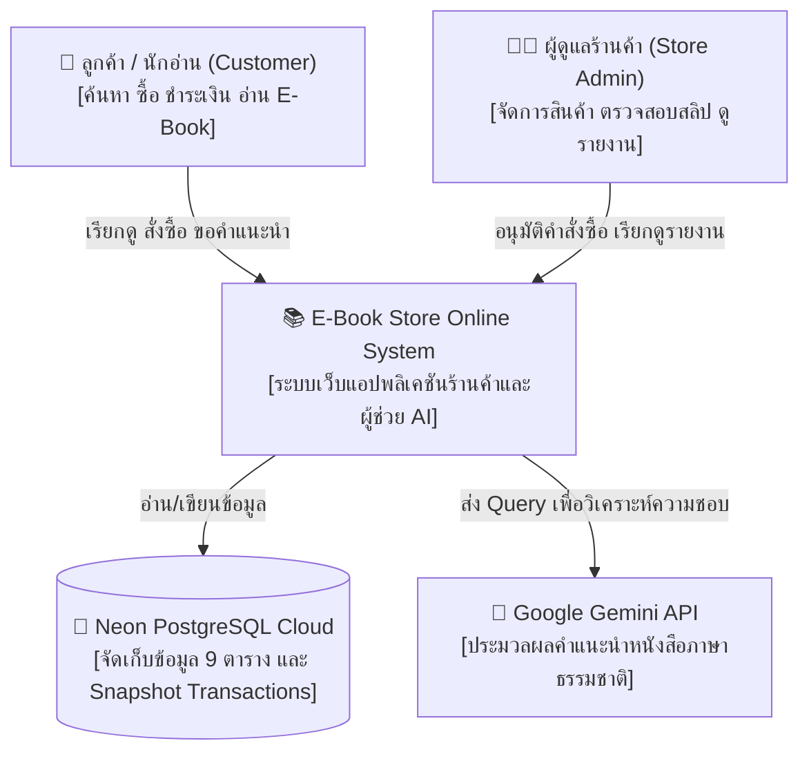
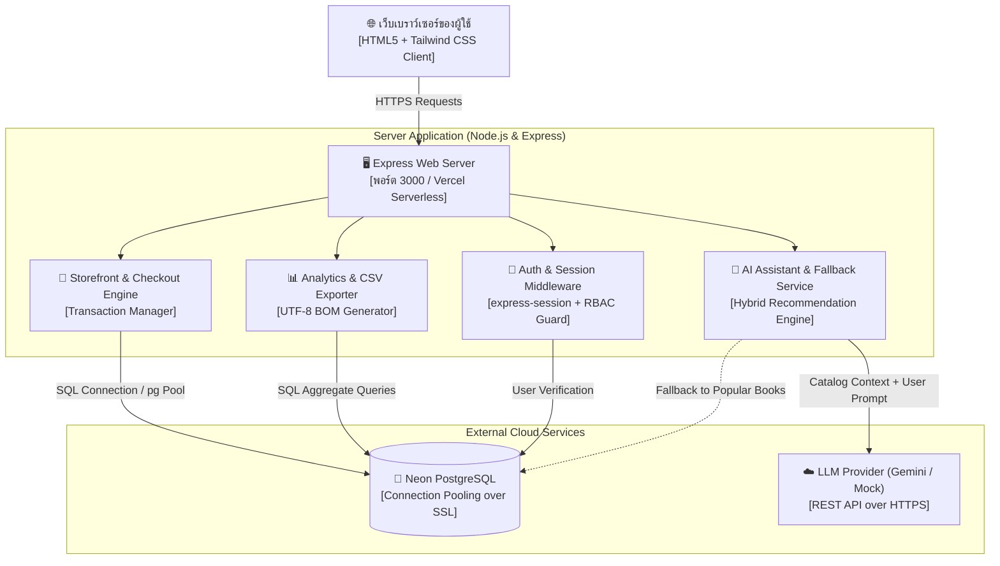
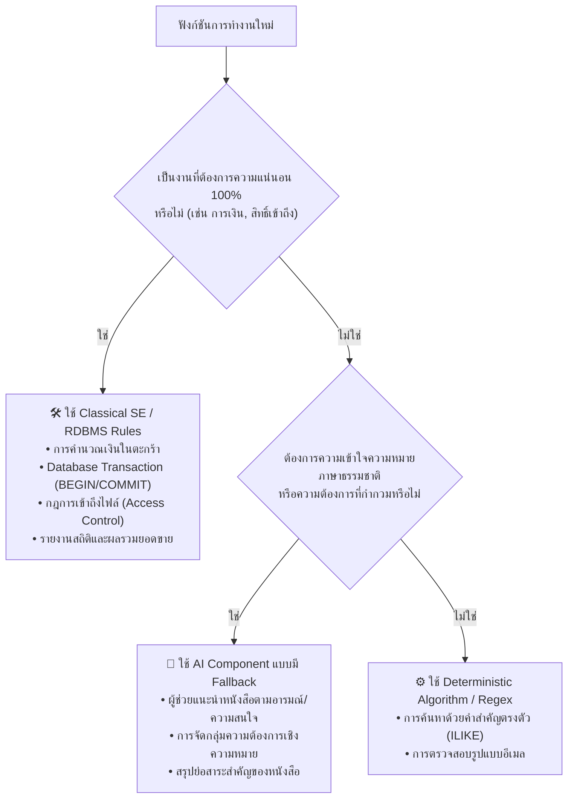
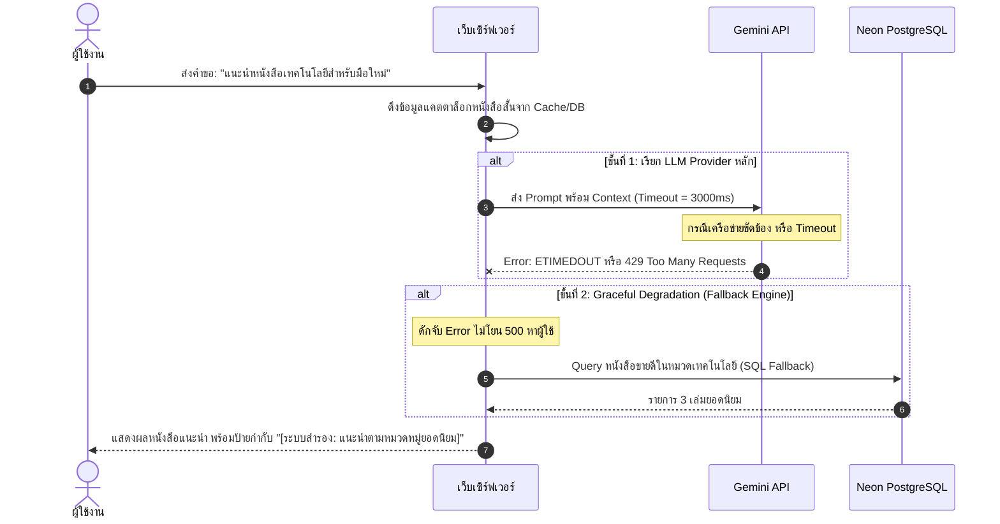

# 🏛️ สถาปัตยกรรมระบบ (System Architecture & C4 Model)

**โครงงาน**: ระบบร้านขายหนังสือและอีบุ๊กออนไลน์ (E-Book Store Online Management System)  
**วิชา**: วิศวกรรมซอฟต์แวร์ในยุค AI (Software Engineering in AI Era)  
**มาตรฐานอ้างอิง**: C4 Model (Context, Container, Component), AI Component Architecture (บทที่ 6 §6.3)

---

## 1. C4 Model Architecture Diagrams

### 1.1 ระดับที่ 1: แผนภาพบริบทของระบบ (System Context Diagram)
แสดงความสัมพันธ์ระหว่างผู้ใช้งานกลุ่มต่าง ๆ กับระบบ E-Book Store และระบบภายนอก



---

### 1.2 ระดับที่ 2: แผนภาพคอนเทนเนอร์ (Container Diagram)
แสดงองค์ประกอบเทคโนโลยีและการแลกเปลี่ยนข้อมูลภายในระบบ



---

### 1.3 ระดับที่ 3: แผนภาพคอมโพเนนต์ (Component Diagram - AI & Storefront Layer)
แสดงการทำงานภายในของโมดูลร้านค้าและการเชื่อมต่อกับ AI Service

```mermaid
graph TD
    ClientReq["Client HTTP Request<br>/ai/recommend หรือ /download/:id"]
    
    subgraph "Application Core"
        RouteGuard["🛡️ Route Guard & Access Control<br>[สิทธิ์ RBAC & ตรวจสอบการเป็นเจ้าของ]"]
        AIService["🧠 AI Service (aiService.js)<br>[Context Builder & Prompt Orchestrator]"]
        FallbackEngine["⚙️ Rule-Based Fallback Engine<br>[SQL Category / Popularity Matching]"]
        DBPool["🔌 Database Connection Pool (db.js)<br>[pg.Pool with SSL]"]
    end
    
    ClientReq --> RouteGuard
    RouteGuard -->|คำขอดาวน์โหลด| DBPool
    RouteGuard -->|คำขอ AI แนะนำ| AIService
    
    AIService -->|1. ดึงแคตตาล็อกหนังสือ| DBPool
    AIService -->|2. เรียก LLM API (Timeout 3s)| RemoteLLM["External LLM"]
    
    RemoteLLM -->|3a. สำเร็จ (Valid JSON)| Response["ส่งคำแนะนำให้ผู้ใช้"]
    RemoteLLM -.->|3b. ล้มเหลว / Timeout / Error| FallbackEngine
    FallbackEngine -->|ดึงหนังสือยอดนิยมตามหมวดหมู่| DBPool
    FallbackEngine --> Response
```

---

## 2. แผนผังการตัดสินใจเลือกใช้ AI vs Classical SE (Decision Tree)

ตามหลักการในบทที่ 6 §6.3 และบทที่ 14 §14.4 ซอฟต์แวร์วิศวกรรมที่ดีต้องไม่ใช้ LLM กับทุกปัญหา การตัดสินใจในโครงการ E-Book Store เป็นไปตามแผนผังดังนี้:



### สรุปเหตุผลของการจัดแบ่ง:
1. **การเงินและการชำระเงิน**: ใช้ SQL Constraints และ ACID Transaction 100% ห้ามใช้ LLM ในการคำนวณยอดเงินเด็ดขาด
2. **การดาวน์โหลดไฟล์ดิจิทัล**: ตรวจสอบความเป็นเจ้าของคำสั่งซื้อผ่าน SQL Query แบบ Strict Authorization ห้ามพึ่งพาการตัดสินใจของ AI
3. **การแนะนำหนังสือ**: เหมาะสมอย่างยิ่งสำหรับ LLM เพราะผู้ใช้อาจพิมพ์คำค้นหาที่ไม่มีคำสำคัญตรงในชื่อเรื่อง เช่น *"อยากหาแรงบันดาลใจเริ่มทำธุรกิจ"* ซึ่ง AI สามารถเชื่อมโยงกับหนังสือหมวดการเงิน/การพัฒนาตนเองได้

---

## 3. ยุทธศาสตร์การรับมือความล้มเหลว (Graceful Fallback Strategy)

เมื่อระบบภายนอก (LLM Provider) เกิดปัญหา เช่น เครือข่ายล่ม, Rate Limit เกิน, หรือ API Key ขัดข้อง ระบบ E-Book Store จะดำเนินตาม **3-Stage Fallback Chain**:



### ผลลัพธ์:
* **User Experience (UX)**: ผู้ใช้ยังคงได้รับรายการหนังสือแนะนำที่เกี่ยวข้องเสมอ ไม่พบหน้าต่าง Error หรือระบบค้าง
* **System Observability**: บันทึกเหตุการณ์ Fallback ลงใน Observability Logger เพื่อแจ้งเตือนวิศวกรผู้ดูแลระบบ
