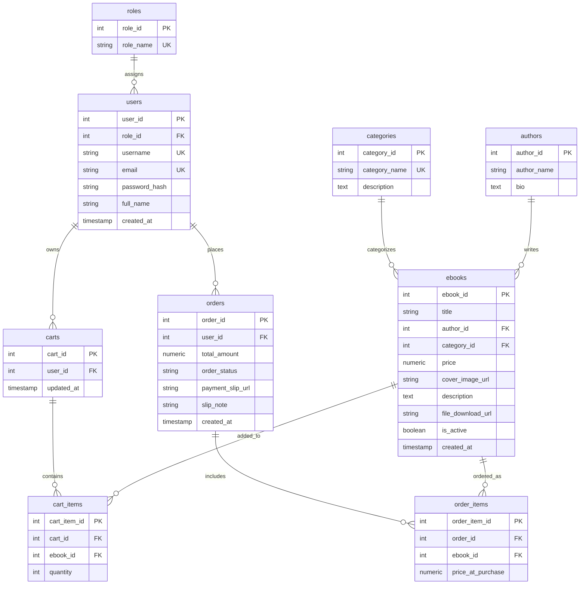

# ผังความสัมพันธ์ข้อมูล (Entity-Relationship Diagram: ERD)

## คำอธิบายความสัมพันธ์และโครงสร้าง 3NF:
1. **`roles` และ `users` (1:N)**: ผู้ใช้งานแต่ละคนมีบทบาทเดียว (`customer` หรือ `admin`) เพื่อใช้ในการควบคุมสิทธิ์แบบ RBAC
2. **`categories` และ `ebooks` (1:N)**: หนังสือแต่ละเล่มสังกัดหนึ่งหมวดหมู่หลัก
3. **`authors` และ `ebooks` (1:N)**: หนังสือแต่ละเล่มมีผู้แต่งหลัก
4. **`carts` และ `cart_items` (1:N)**: ผู้ใช้ 1 คนมี 1 ตะกร้าสินค้า ซึ่งบรรจุรายการหนังสือที่กำลังเลือกซื้อ
5. **`orders` และ `order_items` (1:N)**: เมื่อสั่งซื้อ ข้อมูลจะถูกถ่ายโอนจากตะกร้ามายังคำสั่งซื้อ โดย `order_items` ทำหน้าที่เป็น Junction Table
6. **Snapshot Price**: ฟิลด์ `price_at_purchase` ใน `order_items` จัดเก็บราคา ณ วินาทีที่ซื้อ ป้องกันปัญหาการแก้ไขราคาในตาราง `ebooks` แล้วกระทบยอดรวมคำสั่งซื้อในอดีต
