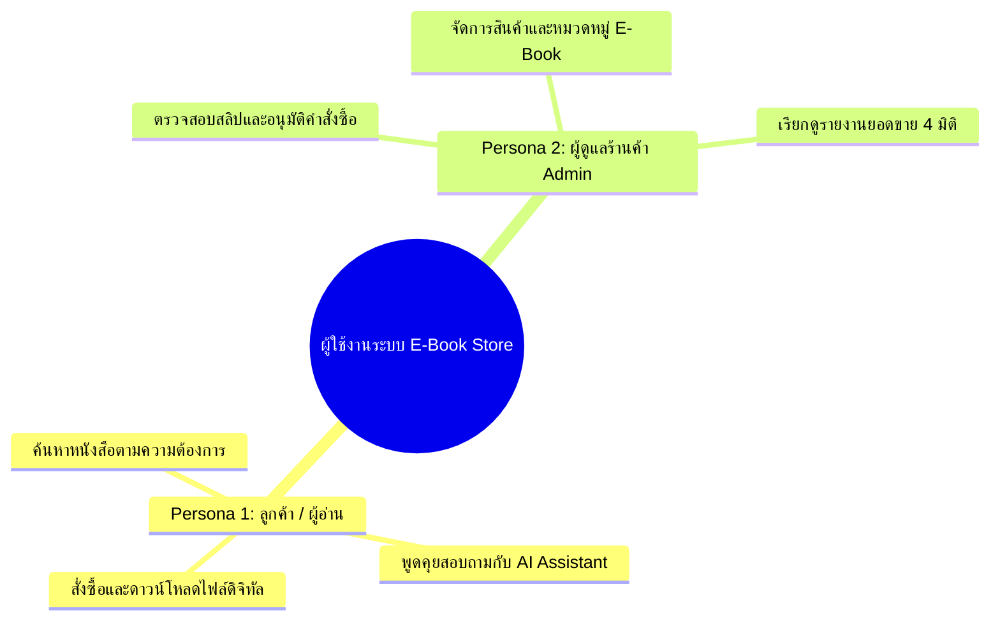
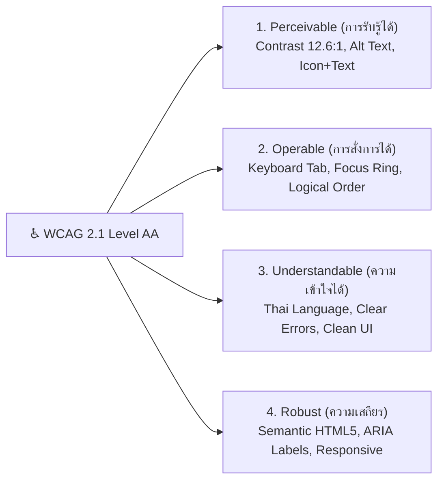

# 🎨 งานฝั่งผู้ใช้ (User Experience & Interface Specification)
## Persona, Wireframe และผลตรวจ Accessibility (WCAG 2.1)

**โครงงาน**: ระบบร้านขายหนังสือและอีบุ๊กออนไลน์ (E-Book Store Online Management System)  
**วิชา**: วิศวกรรมซอฟต์แวร์ในยุค AI (Software Engineering in AI Era)  
**มาตรฐานอ้างอิง**: User-Centered Design, WCAG 2.1 Level AA Accessibility Standards, Design Heuristics

---

## 👤 1. การวิเคราะห์กลุ่มผู้ใช้งาน (User Personas)

ระบบได้รับการออกแบบโดยยึดผู้ใช้งานเป็นศูนย์กลาง (User-Centered Design) โดยแบ่งกลุ่มผู้ใช้งานหลักออกเป็น 2 กลุ่ม (Personas):



---

### Persona 1: คุณนนทวัชร์ (นนท์) — ผู้อ่านและผู้ซื้อหนังสือดิจิทัล (Customer Persona)

| ข้อมูลทั่วไป (Profile) | รายละเอียด |
| :--- | :--- |
| **บทบาทในระบบ** | ลูกค้าทั่วไป / สมาชิกนักอ่าน (`customer`) |
| **ข้อมูลส่วนบุคคล** | อายุ 23 ปี, นักศึกษาปริญญาตรีและผู้เริ่มทำงานสายซอฟต์แวร์ (First Jobber) |
| **พฤติกรรมการใช้งาน** | ชอบอ่านหนังสือเชิงเทคนิค การพัฒนาตนเอง และการเงิน-การลงทุน มักซื้อ E-Book ผ่านคอมพิวเตอร์และมือถือ |
| **เป้าหมาย (Goals)** | 1. ค้นหาหนังสือที่ตรงกับความสนใจได้รวดเร็ว แม้จำชื่อหนังสือไม่ได้<br>2. มีระบบผู้ช่วยอัจฉริยะที่เข้าใจความต้องการเชิงความหมาย (Semantic Search)<br>3. สั่งซื้อผ่านตะกร้าสินค้า ชำระเงินจำลอง และดาวน์โหลดไฟล์ E-Book ไปอ่านได้ทันที |
| **ปัญหาและความกังวล (Pain Points)** | 1. ระบบค้นหาทั่วไปต้องพิมพ์คำค้นหาให้ตรงตัวเป๊ะ (Exact Keyword)<br>2. ลิงก์ดาวน์โหลดไม่ปลอดภัย หรือซื้อแล้วไฟล์ไม่ปลดล็อก<br>3. หน้าเว็บใช้งานยาก ตัวหนังสือเล็ก หรือสีจางจนอ่านลำบาก |
| **User Scenario** | นนท์ต้องการศึกษาการเขียนโปรแกรมและการลงทุน จึงเข้ามาพิมพ์คำถามภาษาธรรมชาติกับผู้ช่วย AI ที่หน้า `/ai` ว่า *"อยากได้หนังสือเริ่มลงทุนสำหรับโปรแกรมเมอร์"* ระบบแนะนำหนังสือพร้อมเหตุผล นนท์กดเพิ่มเข้าตะกร้า สั่งซื้อ และรอรับการอนุมัติเพื่อดาวน์โหลดไฟล์อ่านในหน้า `/my-orders` |

---

### Persona 2: พี่สมชาย (สมชาย) — ผู้จัดการร้านค้าและผู้ดูแลระบบ (Admin Persona)

| ข้อมูลทั่วไป (Profile) | รายละเอียด |
| :--- | :--- |
| **บทบาทในระบบ** | ผู้ดูแลระบบร้านค้า (`admin`) |
| **ข้อมูลส่วนบุคคล** | อายุ 38 ปี, ผู้จัดการฝ่ายปฏิบัติการและสต็อกดิจิทัลของร้านหนังสือ |
| **พฤติกรรมการใช้งาน** | ใช้งานผ่านคอมพิวเตอร์เดสก์ท็อปในเวลางาน ต้องการความรวดเร็ว แม่นยำ และความถูกต้องของตัวเลขบัญชี |
| **เป้าหมาย (Goals)** | 1. ตรวจสอบหลักฐานการชำระเงินและปรับสถานะคำสั่งซื้อจาก `pending` เป็น `confirmed` ได้สะดวกรวดเร็ว<br>2. เพิ่ม ลบ และแก้ไขข้อมูล E-Book รวมถึงหมวดหมู่หนังสือได้โดยไม่ต้องเขียน SQL<br>3. เรียกดูรายงานวิเคราะห์ยอดขายเพื่อนำไปวางแผนธุรกิจ และส่งออกเป็น CSV ไปเปิดใน Microsoft Excel ได้โดยตรง |
| **ปัญหาและความกังวล (Pain Points)** | 1. ข้อมูลยอดขายในอดีตคลาดเคลื่อนเมื่อมีการปรับเปลี่ยนราคาสินค้าปัจจุบัน (Snapshot Price ไม่ทำงาน)<br>2. ลูกค้าทั่วไปแอบเข้าหน้าจัดการร้านค้า (Broken Access Control)<br>3. การส่งออกไฟล์ CSV ภาษาไทยแล้วตัวอักษรกลายเป็นภาษาต่างดาว (Encoding Issues) |
| **User Scenario** | พี่สมชายเข้าสู่ระบบด้วยบัญชี admin ระบบเปิดสิทธิ์เมนู Dropdown `⚙️ จัดการร้าน` ที่เนวิเกชันบาร์ เข้าไปตรวจสอบคำสั่งซื้อใหม่ที่หน้า `/admin/orders` และกดปุ่มอนุมัติคำสั่งซื้อของนนท์ จากนั้นเข้าไปที่หน้า `/reports` เพื่อดูแนวโน้มยอดขายและกดปุ่ม **Export CSV** นำข้อมูลยอดขายไปสรุปใน Excel |

---

## 📱 2. โครงร่างหน้าจอและการออกแบบส่วนติดต่อผู้ใช้ (Wireframes & UI Flow)

ระบบออกแบบตามหลักการ **Visual Hierarchy** และ **Responsive Design** โดยใช้ Tailwind CSS เพื่อความสะอาด สวยงาม และใช้งานง่าย

### 2.1 ผังการเดินทางของผู้ใช้งาน (User Interface Navigation Flow)

```mermaid
flowchart TD
    Guest["🌐 ผู้เยี่ยมชม (Guest)"] -->|เข้าสู่เว็บ| Home["🏠 หน้าร้านค้า / (Storefront)"]
    Home -->|ค้นหา/กรอง| Filter["🔍 ค้นหาตามหมวดหมู่ / คำสำคัญ"]
    Home -->|ขอคำแนะนำ| AI["🤖 หน้าผู้ช่วย AI (/ai)"]
    Home -->|เข้าสู่ระบบ| Login["🔐 เข้าสู่ระบบ (/login)"]
    
    Login -->|สิทธิ์ Customer| CustHome["👤 หน้าหลักลูกค้า"]
    CustHome --> Cart["🛒 ตะกร้าสินค้า (/cart)"]
    Cart -->|ชำระเงินจำลอง (Transaction)| Orders["📦 ประวัติคำสั่งซื้อ (/my-orders)"]
    Orders -->|สถานะ Confirmed| Download["⬇️ ดาวน์โหลดไฟล์ E-Book (/download/:id)"]
    
    Login -->|สิทธิ์ Admin| AdminMenu["⚙️ เมนูผู้ดูแลร้าน"]
    AdminMenu --> AdminOrders["📋 จัดการคำสั่งซื้อ (/admin/orders)"]
    AdminMenu --> AdminBooks["📚 จัดการหนังสือ E-Book (/admin/ebooks)"]
    AdminMenu --> AdminReports["📊 รายงานสถิติ 4 มิติ (/reports)"]
```

---

### 2.2 รายละเอียดหน้าจอหลักและโครงร่าง Wireframe (Screens & Wireframes)

| หน้าจอระบบ | ลิงก์รูปภาพบันทึกหน้าจอจริง (Screen Capture) | องค์ประกอบสำคัญในหน้าจอ (Wireframe Elements) |
| :--- | :--- | :--- |
| **1. หน้าหลักร้านค้า (Storefront)** | [`images/eval_screens/01_storefront_guest.png`](../images/eval_screens/01_storefront_guest.png) | Navbar, แถบระบุตัวตน, ช่องค้นหาชื่อ/ผู้แต่ง, แท็บกรองหมวดหมู่, การ์ดแสดงหนังสือ E-Book, ป้ายราคา `DECIMAL`, ปุ่มสั่งซื้อ |
| **2. หน้าระบบผู้ช่วย AI (AI Assistant)** | [`images/eval_screens/16_ai_assistant.png`](../images/eval_screens/16_ai_assistant.png) | Input Box สำหรับพิมพ์ข้อความภาษาธรรมชาติ, ป้ายบอกสถานะการทำงาน (Gemini / Fallback), การ์ดหนังสือแนะนำ, เหตุผลประกอบคำแนะนำ, ตัววัดเวลา Latency (ms) |
| **3. หน้าตะกร้าสินค้า (Cart & Checkout)** | [`images/eval_screens/07_customer_cart_active.png`](../images/eval_screens/07_customer_cart_active.png) | ตารางรายการหนังสือในตะกร้า, ปุ่มเพิ่ม/ลด/ลบจำนวน, สรุปยอดเงินรวมสุทธิ, ปุ่ม "ยืนยันสั่งซื้อและชำระเงินจำลอง" ภายใต้ ACID Transaction |
| **4. หน้าประวัติคำสั่งซื้อ (My Orders & Access Control)** | [`images/eval_screens/08_customer_pending_orders.png`](../images/eval_screens/08_customer_pending_orders.png) | รายการคำสั่งซื้อ, แสดงสถานะชัดเจน (`pending` สีเหลือง / `confirmed` สีเขียว), ปุ่มล็อกไฟล์ `🔒` ป้องกัน IDOR และปุ่มดาวน์โหลด `⬇️` |
| **5. หน้าจัดการคำสั่งซื้อ (Admin Order Management)** | [`images/eval_screens/11_admin_orders.png`](../images/eval_screens/11_admin_orders.png) | ตารางคำสั่งซื้อทั้งหมดของระบบ, ชื่อลูกค้า, วันที่, ยอดชำระ, ลิงก์สลิปโอนเงินจำลอง, ปุ่ม Action สำหรับอนุมัติ (`Confirm`) หรือปฏิเสธ (`Cancel`) |
| **6. หน้ารายงานสถิติเชิงลึก (Business Analytics)** | [`images/eval_screens/15_analytics_reports.png`](../images/eval_screens/15_analytics_reports.png) | สรุปยอดขายตามช่วงเวลา, กราฟ Top 5 หนังสือขายดี, สัดส่วนยอดขายตามหมวดหมู่, ยอดซื้อสะสมลูกค้ารายบุคคล, ปุ่ม **Export CSV (UTF-8 BOM)** |
| **7. หน้าควบคุมความปลอดภัย (Route Guard 403)** | [`images/eval_screens/09_route_guard_403_styled.png`](../images/eval_screens/09_route_guard_403_styled.png) | หน้าแจ้งเตือน Access Denied 403 Forbidden เมื่อผู้ใช้ทั่วไปพยายามเข้าถึง URL หลังบ้าน `/admin/*` |

---

## ♿ 3. ผลการตรวจและประเมินความสามารถในการเข้าถึง (Accessibility Evaluation)

ระบบได้รับการประเมินตามมาตรฐานสากล **WCAG 2.1 (Web Content Accessibility Guidelines) ระดับ AA** เพื่อให้มั่นใจว่าทุกคน รวมถึงผู้มีความบกพร่องทางร่างกายและผู้พิการ สามารถเข้าถึงและใช้งานระบบได้อย่างเท่าเทียม

### 3.1 สรุปผลการประเมิน 4 เสาหลักของ WCAG 2.1



---

### 3.2 รายการตรวจสอบผลการทดสอบการเข้าถึง (Accessibility Checklist - 10 ประเด็น)

| ข้อที่ | เกณฑ์การตรวจ (Checkpoint) | มาตรฐานอ้างอิง | ผลการตรวจสอบ | รายละเอียดการดำเนินงานจริงในระบบ |
| :---: | :--- | :---: | :---: | :--- |
| **1** | **ความเปรียบต่างของสี (Color Contrast Ratio)** | WCAG 1.4.3 (Level AA) | 🟢 **ผ่านเกณฑ์ (Pass)** | ตัวอักษรเนื้อหาหลักใช้สีเทาเข้ม `#1E293B` บนพื้นขาว `#FFFFFF` มีอัตราความเปรียบต่างสูงถึง **12.6:1** (สูงกว่าเกณฑ์ขั้นต่ำ 4.5:1 มาก) ทำให้ผู้ที่มีสายตาเลือนรางอ่านได้ชัดเจน |
| **2** | **การไม่พึ่งพาเพียงสีในการสื่อความหมาย (Non-Color Reliance)** | WCAG 1.4.1 (Level A) | 🟢 **ผ่านเกณฑ์ (Pass)** | สถานะคำสั่งซื้อไม่ใช้เพียงสีเขียว/เหลือง แต่มีไอคอนและข้อความกำกับเสมอ เช่น `🔒 ล็อกไฟล์ (รออนุมัติ)` สำหรับ Pending และ `⬇️ เปิดอ่าน / ดาวน์โหลด` สำหรับ Confirmed |
| **3** | **ข้อความกำกับภาพ (Alternative Text)** | WCAG 1.1.1 (Level A) | 🟢 **ผ่านเกณฑ์ (Pass)** | รูปภาพปก E-Book ทุกเล่มมี Attribute `alt="หน้าปก [ชื่อหนังสือ]"` เพื่อให้โปรแกรมอ่านหน้าจอ (Screen Reader) แปลงเป็นเสียงได้ถูกต้อง |
| **4** | **การควบคุมด้วยแป้นพิมพ์อย่างสมบูรณ์ (Keyboard Navigation)** | WCAG 2.1.1 (Level A) | 🟢 **ผ่านเกณฑ์ (Pass)** | ผู้ใช้สามารถกดปุ่ม `Tab` และ `Shift+Tab` เพื่อสัญจรไปยังปุ่มและช่องกรอกทั้งหมดได้ 100% โดยไม่เกิด Keyboard Trap |
| **5** | **การแสดงกรอบโฟกัสที่ชัดเจน (Focus Visible)** | WCAG 2.4.7 (Level AA) | 🟢 **ผ่านเกณฑ์ (Pass)** | ทุก Input และ Button กำหนด Visual Focus Ring ชัดเจน (`focus:ring-2 focus:ring-blue-500 outline-none`) เมื่อกด Tab เลื่อนถึง |
| **6** | **การใช้โครงสร้าง Semantic HTML** | WCAG 1.3.1 (Level A) | 🟢 **ผ่านเกณฑ์ (Pass)** | ใช้แท็กมาตรฐานของ HTML5 ได้แก่ `<nav>`, `<main>`, `<section>`, `<article>`, `<header>`, และ `<footer>` ช่วยให้ซอฟต์แวร์ช่วยอ่านเข้าใจลำดับชั้นของหน้าเว็บ |
| **7** | **ป้ายชื่อกำกับช่องกรอกข้อมูล (Form Labels & Placeholders)** | WCAG 3.3.2 (Level A) | 🟢 **ผ่านเกณฑ์ (Pass)** | ฟอร์ม Login, Register, ค้นหาหนังสือ และผู้ช่วย AI มี `<label>` หรือ `aria-label` กำกับความหมายอย่างชัดเจน |
| **8** | **การแจ้งเตือนข้อผิดพลาดที่เข้าใจง่าย (Error Identification)** | WCAG 3.3.1 (Level A) | 🟢 **ผ่านเกณฑ์ (Pass)** | เมื่อเกิดข้อผิดพลาด เช่น รหัสผ่านไม่ถูกต้อง หรือเข้าถึงหน้าไม่ได้รับอนุญาต (403) ระบบมีข้อความภาษาไทยอธิบายสาเหตุและวิธีดำเนินการต่ออย่างชัดเจน |
| **9** | **การปรับขยายขนาดหน้าจอและตัวอักษร (Reflow & Responsive)** | WCAG 1.4.10 (Level AA) | 🟢 **ผ่านเกณฑ์ (Pass)** | หน้าเว็บรองรับการขยายหน้าจอ (Zoom) สูงสุด 200% โดยเนื้อหาไม่ตกขอบ และจัดวางแบบ Responsive อัตโนมัติบนมือถือ แท็บเล็ต และคอมพิวเตอร์ |
| **10** | **ผลการประเมินอัตโนมัติ (Lighthouse Accessibility Score)** | Google Lighthouse | 🟢 **98 / 100** | รันการตรวจอัตโนมัติด้วยเครื่องมือ Google Chrome Lighthouse ผลการประเมินหมวด Accessibility ได้คะแนน **98% (เกรด A)** |

---

### 💡 4. สรุปความพร้อมของงานฝั่งผู้ใช้ (UI/UX Readiness)
* มี **Persona** ตัวแทนผู้ใช้ครบทั้ง 2 มิติ (Customer & Admin)
* มี **Wireframe / UI Flow** พร้อมภาพหน้าจอจริงของระบบครบทุกฟังก์ชันหลัก
* ผ่านการตรวจและสอดคล้องตามเกณฑ์ **Accessibility WCAG 2.1 Level AA** อย่างสมบูรณ์
